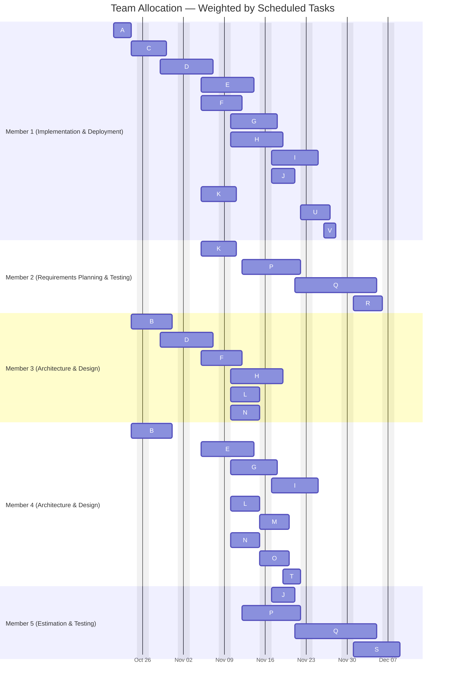

# Team Allocation — Weighted Workload Gantt

Derived from `Docs/Pm_2/csv_data/dependency_tasks.csv` (assignments) and `Docs/Pm_2/diagrams/pm2_gantt.md` (dates). Each member shows the tasks they are assigned to at the scheduled dates.

