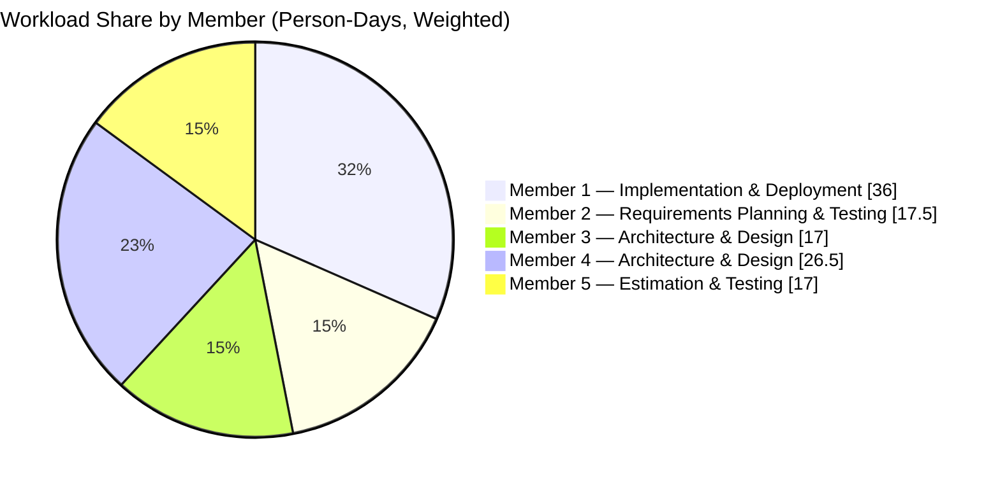

# Team Allocation — Weighted by Task Durations

Computed from `Docs/Pm_2/csv_data/dependency_tasks.csv` by splitting each task's duration equally among its listed team members.

Notes:
- Person-days are calculated as: for each task, `Duration / (# of assigned members)` added to each member.
- Example: Task `D` (7d) assigned to Member 1 & Member 3 contributes `3.5` to each.
- If you prefer different splits (e.g., weight backend/frontend differently), share ratios and I’ll recompute.
