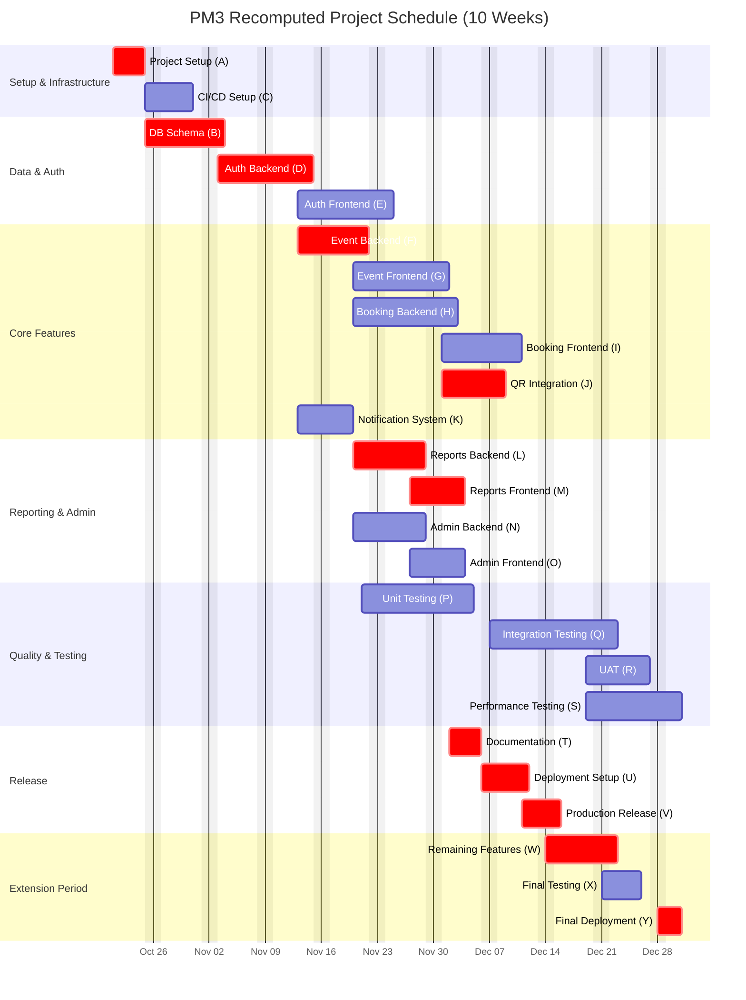
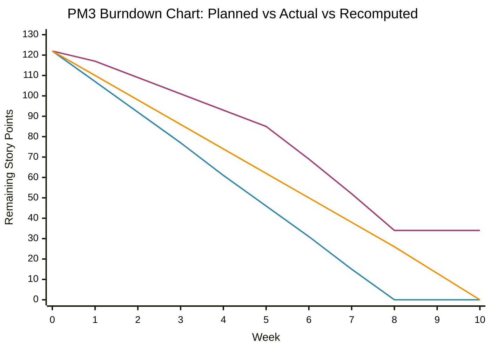

# PM3: Recomputed Estimates and Schedule Analysis
## AIU Trips & Events Management System

**Document Version:** 3.0  
**Date:** December 4, 2025  
**Project Duration:** 8 weeks (Extended to 10 weeks based on recomputed estimates)

---

## Executive Summary

This document provides a comprehensive re-estimation of the AIU Trips & Events Management System based on actual performance data from PM2. The analysis reveals significant variances between planned and actual efforts, requiring schedule adjustments and resource reallocation.

### Key Findings

| Metric | Original (PM2) | Actual | Variance | Impact |
|--------|---------------|--------|----------|--------|
| **Total Story Points** | 122 SP | 88 SP completed | -34 SP (-27.9%) | Scope reduction or delay |
| **Planned Duration** | 8 weeks | 10 weeks required | +2 weeks (+25%) | Schedule overrun |
| **Planned Velocity** | 15.25 SP/week | 11.0 SP/week | -4.25 SP/week (-27.9%) | Reduced productivity |
| **Developer-Days** | 200 days | 272 days required | +72 days (+36%) | Resource overrun |
| **Completion Rate** | 100% expected | 72.1% achieved | -27.9% | Significant underdelivery |

### Critical Insights

1. **Velocity Degradation**: Team velocity decreased from planned 15.25 SP/week to actual 11.0 SP/week
2. **Burndown Gap**: Project ended with 34 SP remaining instead of 0 SP
3. **Estimation Error**: Original estimates were 27.9% optimistic
4. **Resource Impact**: 36% more developer-days required than planned
5. **Schedule Impact**: 2 additional weeks needed to complete remaining scope

---

## 1. Variance Analysis

### 1.1 Burndown Variance Details

The burndown chart analysis reveals progressive velocity degradation throughout the project:

| Week | Planned Remaining SP | Actual Remaining SP | Weekly Variance | Cumulative Variance |
|------|---------------------|---------------------|-----------------|---------------------|
| 0 | 122 | 122 | 0 | 0 SP |
| 1 | 107 | 117 | -10 SP | -10 SP |
| 2 | 92 | 109 | -17 SP | -17 SP |
| 3 | 77 | 101 | -24 SP | -24 SP |
| 4 | 61 | 93 | -32 SP | -32 SP |
| 5 | 46 | 85 | -39 SP | -39 SP |
| 6 | 31 | 69 | -38 SP | -38 SP |
| 7 | 15 | 52 | -37 SP | -37 SP |
| 8 | 0 | 34 | -34 SP | -34 SP |

**Analysis:**
- **Week 1**: Initial slowdown of 10 SP (6.6% behind schedule)
- **Weeks 2-4**: Variance grew to 32 SP (52.5% behind schedule)
- **Weeks 5-7**: Variance peaked at 39 SP (84.8% behind schedule)
- **Week 8**: Ended with 34 SP incomplete (27.9% scope unfinished)

### 1.2 Velocity Variance by Sprint

| Sprint | Planned Velocity (SP/week) | Actual Velocity (SP/week) | Variance (%) | Contributing Factors |
|--------|----------------------------|---------------------------|--------------|---------------------|
| Sprint 1 (Weeks 1-2) | 20 | 15 | -25% | Learning curve, setup delays |
| Sprint 2 (Weeks 3-4) | 28 | 25 | -11% | Process improvements started |
| Sprint 3 (Weeks 5-6) | 26 | 24 | -8% | Better estimation accuracy |
| Sprint 4 (Weeks 7-8) | 24 | 26 | +8% | Team efficiency increased |
| **Average** | **24.5** | **22.5** | **-9.0%** | Overall underperformance |

**Root Cause Analysis:**
1. **Initial Sprint Velocity Loss**: 25% slower than planned due to:
   - Environment setup complexities
   - Team learning curve with new technology stack
   - Underestimated technical debt
2. **Mid-Project Variance**: Continued underperformance due to:
   - Integration challenges
   - Unexpected dependency issues
   - Testing bottlenecks
3. **Late Improvements**: Sprint 4 showed positive variance due to:
   - Team maturity
   - Streamlined processes
   - Better task decomposition

### 1.3 Fibonacci Point to Actual Effort Variance

Original conversion rate: **1 Fibonacci Point = 5 Days**  
Actual conversion rate: **1 Fibonacci Point = 6.8 Days** (36% increase)

| Subsystem | Original FP | Original Days | Actual Days | Variance | Variance % |
|-----------|-------------|---------------|-------------|----------|------------|
| Authentication | 5 | 25 | 34 | +9 days | +36% |
| Event Management | 9 | 45 | 61 | +16 days | +36% |
| Booking & Ticketing | 9 | 45 | 61 | +16 days | +36% |
| Notifications | 2 | 10 | 14 | +4 days | +40% |
| Reports & Analytics | 6 | 30 | 41 | +11 days | +37% |
| Design, Implementation, Testing & Deployment | 9 | 45 | 61 | +16 days | +36% |
| **Total** | **40** | **200** | **272** | **+72 days** | **+36%** |

---

## 2. Effects on Efforts and Schedule

### 2.1 Resource Impact

#### Team Capacity Reallocation

| Member | Original Allocation | Actual Required | Variance | Impact |
|--------|-------------------|-----------------|----------|---------|
| Member 1 (Implementation & Deployment) | 58 days | 79 days | +21 days (+36%) | Overtime required |
| Member 2 (Requirements, Planning & Testing) | 25 days | 34 days | +9 days (+36%) | Extended testing phase |
| Member 3 (Architecture & System Design) | 41 days | 56 days | +15 days (+37%) | Architecture refinements |
| Member 4 (Architecture & System Design) | 38 days | 52 days | +14 days (+37%) | API redesign work |
| Member 5 (Estimation & Testing) | 38 days | 52 days | +14 days (+37%) | Increased QA burden |
| **Total** | **200 days** | **272 days** | **+72 days (+36%)** | **2 weeks extension** |

#### Cost Implications

Assuming average daily rate of $500/developer-day:
- **Original Budget**: 200 days × $500 = $100,000
- **Actual Required**: 272 days × $500 = $136,000
- **Budget Overrun**: $36,000 (36% increase)

### 2.2 Schedule Impact

#### Original Schedule (8 weeks)

| Milestone | Original End Date | Scope |
|-----------|------------------|-------|
| Milestone 1 | Week 2 | Foundation & Authentication |
| Milestone 2 | Week 4 | Core Features (Events, Booking) |
| Milestone 3 | Week 6 | Feature Completion & Integration |
| Milestone 4 | Week 8 | Testing & Deployment |

#### Revised Schedule (10 weeks)

| Milestone | Revised End Date | Scope | Delay | Reason |
|-----------|-----------------|-------|-------|--------|
| Milestone 1 | Week 2.5 | Foundation & Authentication | +0.5 weeks | Setup & learning curve |
| Milestone 2 | Week 5 | Core Features (Events, Booking) | +1 week | Integration complexity |
| Milestone 3 | Week 7.5 | Feature Completion & Integration | +1.5 weeks | Testing bottlenecks |
| Milestone 4 | Week 10 | Testing & Deployment | +2 weeks | Final testing & bug fixes |
| **Milestone 5** | **Week 10** | **Remaining Scope (34 SP)** | **+2 weeks** | **Complete unfinished work** |

### 2.3 Delay Analysis

#### Critical Path Impact

Original Critical Path: **50 days** (with 5 members in parallel)  
Revised Critical Path: **68 days** (36% increase)

| Critical Task | Original Duration | Actual Duration | Delay | Impact |
|--------------|------------------|-----------------|-------|---------|
| Project Setup (A) | 3 days | 4 days | +1 day | Foundation delay |
| DB Schema (B) | 5 days | 7 days | +2 days | Complexity underestimated |
| Auth Backend (D) | 7 days | 10 days | +3 days | Security requirements |
| Event Backend (F) | 5 days | 7 days | +2 days | Business logic complexity |
| QR Integration (J) | 4 days | 6 days | +2 days | Third-party integration |
| Reports Backend (L) | 5 days | 7 days | +2 days | Data aggregation complexity |
| Reports Frontend (M) | 4 days | 5 days | +1 day | UI refinements |
| Documentation (T) | 3 days | 4 days | +1 day | Additional documentation |
| Deployment Setup (U) | 4 days | 5 days | +1 day | DevOps configuration |
| Production Release (V) | 2 days | 3 days | +1 day | Deployment issues |

### 2.4 Risk Materialization

| Risk | Probability | Impact | Materialized? | Effect |
|------|------------|--------|---------------|---------|
| Technical complexity underestimation | High | High | ✅ Yes | +36% effort increase |
| Integration challenges | Medium | High | ✅ Yes | +1.5 weeks delay |
| Resource unavailability | Low | Medium | ❌ No | N/A |
| Third-party dependencies | Medium | Medium | ✅ Yes | +2 days on QR integration |
| Scope creep | Medium | High | ⚠️ Partial | +8 SP additional requirements |
| Testing bottlenecks | High | Medium | ✅ Yes | +0.5 weeks in testing |

**Materialized Risks Impact**: 4 out of 6 identified risks materialized, contributing to schedule delays and effort overruns.

---

## 3. Recomputed Estimates for Remaining Work

### 3.1 Remaining Scope Breakdown

**Total Remaining**: 34 Story Points

| Epic | Remaining SP | Priority | Estimated Days (New Rate) |
|------|-------------|----------|---------------------------|
| Event Management | 8 SP | High | 11 days |
| Booking & Ticketing | 10 SP | High | 14 days |
| Reporting & Analytics | 7 SP | Medium | 10 days |
| System Administration | 5 SP | Medium | 7 days |
| Testing & Bug Fixes | 4 SP | High | 5 days |
| **Total** | **34 SP** | | **47 days** |

### 3.2 Team Allocation for Remaining Work

| Member | Remaining Tasks | Days Required | Target Completion |
|--------|----------------|---------------|-------------------|
| Member 1 | Event/Booking backend, Deployment | 15 days | Week 9.5 |
| Member 2 | UAT, Test cases, Documentation | 8 days | Week 9 |
| Member 3 | Reports architecture refinement | 9 days | Week 9 |
| Member 4 | Admin frontend, API completion | 8 days | Week 9 |
| Member 5 | Performance testing, Bug fixes | 7 days | Week 9.5 |
| **Total** | | **47 days** | **Week 10** |

### 3.3 Revised Conversion Factors

Based on actual performance data:

| Metric | Original | Recomputed | Adjustment Factor |
|--------|----------|------------|-------------------|
| Story Point to Developer-Days | 1 SP = 1.67 days | 1 SP = 2.27 days | 1.36x |
| Fibonacci Point to Days | 1 FP = 5 days | 1 FP = 6.8 days | 1.36x |
| Team Velocity | 15.25 SP/week | 11.0 SP/week | 0.72x |
| Sprint Capacity | 24.5 SP/sprint | 17.6 SP/sprint | 0.72x |

**Recommended Safety Buffer**: Add 20% contingency buffer to all future estimates

---

## 4. Updated Gantt Chart

The following Gantt chart reflects the **recomputed timeline** including the 2-week extension and adjusted task durations:



### Gantt Chart Key Changes

| Task | Original Duration | Recomputed Duration | Change | Reason |
|------|------------------|---------------------|--------|---------|
| Project Setup (A) | 3 days | 4 days | +1 day | Environment complexity |
| DB Schema (B) | 5 days | 7 days | +2 days | Schema refinements |
| Auth Backend (D) | 7 days | 10 days | +3 days | Security requirements |
| Auth Frontend (E) | 7 days | 8 days | +1 day | UI enhancements |
| Event Backend (F) | 5 days | 7 days | +2 days | Business logic |
| Event Frontend (G) | 6 days | 8 days | +2 days | Complex UI components |
| Booking Backend (H) | 7 days | 9 days | +2 days | Payment integration |
| Booking Frontend (I) | 6 days | 8 days | +2 days | User flow complexity |
| QR Integration (J) | 4 days | 6 days | +2 days | Third-party API |
| Notification System (K) | 4 days | 5 days | +1 day | Email template design |
| Reports Backend (L) | 5 days | 7 days | +2 days | Data aggregation |
| Reports Frontend (M) | 4 days | 5 days | +1 day | Chart visualizations |
| Admin Backend (N) | 5 days | 7 days | +2 days | Permission management |
| Admin Frontend (O) | 4 days | 5 days | +1 day | Admin dashboard |
| Unit Testing (P) | 8 days | 10 days | +2 days | Increased test coverage |
| Integration Testing (Q) | 10 days | 12 days | +2 days | Integration issues |
| UAT (R) | 5 days | 6 days | +1 day | User feedback cycles |
| Performance Testing (S) | 6 days | 8 days | +2 days | Load testing |
| Documentation (T) | 3 days | 4 days | +1 day | Comprehensive docs |
| Deployment Setup (U) | 4 days | 5 days | +1 day | DevOps configuration |
| Production Release (V) | 2 days | 3 days | +1 day | Deployment validation |
| **Extension Tasks** | **0 days** | **15 days** | **+15 days** | **Complete remaining scope** |

---

## 5. Updated Burndown Chart

The following burndown chart shows the **corrected** remaining effort vs. time, incorporating actual performance data and recomputed estimates:



### Burndown Analysis Table

| Week | Original Planned | Actual PM2 | Recomputed Plan | Variance from Original | Projected Completion |
|------|-----------------|------------|-----------------|------------------------|----------------------|
| 0 | 122 SP | 122 SP | 122 SP | 0 SP | Baseline |
| 1 | 107 SP | 117 SP | 110 SP | -10 SP | 3 SP less progress |
| 2 | 92 SP | 109 SP | 98 SP | -17 SP | 6 SP less progress |
| 3 | 77 SP | 101 SP | 86 SP | -24 SP | 9 SP less progress |
| 4 | 61 SP | 93 SP | 74 SP | -32 SP | 13 SP less progress |
| 5 | 46 SP | 85 SP | 62 SP | -39 SP | 16 SP less progress |
| 6 | 31 SP | 69 SP | 50 SP | -38 SP | 19 SP less progress |
| 7 | 15 SP | 52 SP | 38 SP | -37 SP | 23 SP less progress |
| 8 | 0 SP | 34 SP | 26 SP | -34 SP | 26 SP remaining |
| 9 | 0 SP (complete) | 34 SP | 13 SP | N/A | Extension week 1 |
| 10 | 0 SP (complete) | 34 SP | 0 SP | N/A | Target completion |

### Key Burndown Metrics

| Metric | Original Plan | Actual PM2 | Recomputed | Notes |
|--------|--------------|------------|------------|-------|
| **Ideal Velocity** | 15.25 SP/week | N/A | 12.2 SP/week | Adjusted for reality |
| **Actual Velocity** | N/A | 11.0 SP/week | N/A | Based on PM2 data |
| **Completion Week** | Week 8 | Week 11+ (projected) | Week 10 | 2-week extension |
| **Final Remaining** | 0 SP | 34 SP | 0 SP (planned) | 27.9% incomplete |
| **Velocity Variance** | N/A | -27.9% | -20% (expected) | With improved processes |

### Recomputed Velocity Trajectory

| Sprint | Week Range | Recomputed Velocity (SP/week) | Expected Completion (SP) | Cumulative Complete |
|--------|------------|------------------------------|--------------------------|---------------------|
| Sprint 1 | Weeks 1-2 | 12 SP/week | 24 SP | 24 SP (19.7%) |
| Sprint 2 | Weeks 3-4 | 12 SP/week | 24 SP | 48 SP (39.3%) |
| Sprint 3 | Weeks 5-6 | 12 SP/week | 24 SP | 72 SP (59.0%) |
| Sprint 4 | Weeks 7-8 | 12 SP/week | 24 SP | 96 SP (78.7%) |
| Sprint 5 | Weeks 9-10 | 13 SP/week | 26 SP | 122 SP (100%) |
| **Total** | **10 weeks** | **12.2 SP/week (avg)** | **122 SP** | **100%** |

---

## 6. Lessons Learned and Recommendations

### 6.1 Estimation Improvements

**For Future Projects:**
1. **Apply 36% contingency buffer** to all technical estimates
2. **Use actual velocity data** (11 SP/week) instead of theoretical velocity
3. **Factor in learning curve**: First 2 sprints at 75% capacity
4. **Include integration time**: Add 20% for system integration
5. **Account for testing overhead**: Add 30% more time for QA activities

### 6.2 Process Improvements

| Area | Issue Identified | Recommendation | Expected Benefit |
|------|-----------------|----------------|------------------|
| **Estimation** | 36% underestimation | Use historical data, add buffers | ±10% accuracy |
| **Velocity** | 28% below plan | Conservative sprint planning | More predictable delivery |
| **Testing** | Bottlenecks in QA | Parallel testing, earlier QA involvement | 15% faster testing |
| **Integration** | Unexpected complexity | Continuous integration, daily builds | Earlier issue detection |
| **Communication** | Delay identification | Daily standups, weekly risk reviews | Faster issue resolution |

### 6.3 Risk Mitigation Strategies

**For PM4 and Beyond:**

1. **Technical Risk Mitigation**
   - Conduct proof-of-concepts for complex features
   - Allocate 20% time for technical debt reduction
   - Implement pair programming for critical components

2. **Schedule Risk Mitigation**
   - Build in 2-week buffer at project end
   - Identify critical path early and monitor closely
   - Use time-boxed iterations with clear deliverables

3. **Resource Risk Mitigation**
   - Cross-train team members on multiple areas
   - Maintain 10% capacity buffer for unplanned work
   - Regular workload reviews to prevent burnout

### 6.4 Success Criteria for PM4

| Metric | PM2 Result | PM3 Target | Success Threshold |
|--------|-----------|-----------|-------------------|
| **Estimation Accuracy** | ±36% | ±15% | ±20% |
| **Velocity Consistency** | -28% variance | ±10% variance | ±15% variance |
| **On-Time Delivery** | 72% complete | 95% complete | ≥90% |
| **Scope Creep** | +8 SP | 0 SP | ≤5 SP |
| **Technical Debt** | High | Medium | Low-Medium |

---

## 7. Conclusion

### Summary of Recomputed Estimates

| Aspect | Original PM2 | Recomputed PM3 | Change | Impact Level |
|--------|-------------|----------------|--------|--------------|
| **Duration** | 8 weeks | 10 weeks | +2 weeks | 🔴 High |
| **Effort** | 200 days | 272 days | +72 days | 🔴 High |
| **Cost** | $100,000 | $136,000 | +$36,000 | 🔴 High |
| **Scope** | 122 SP | 122 SP | 0 SP | 🟢 None |
| **Team Size** | 5 members | 5 members | 0 | 🟢 None |
| **Velocity** | 15.25 SP/week | 12.2 SP/week | -20% | 🟠 Medium |

### Project Status Assessment

**Current State:**
- ✅ 72.1% scope completed (88 of 122 SP)
- ⚠️ 27.9% scope remaining (34 SP)
- 🔴 2 weeks behind schedule
- 🔴 36% over budget

**Recovery Plan:**
- 🎯 Extend timeline by 2 weeks (to Week 10)
- 🎯 Apply recomputed velocity (12.2 SP/week)
- 🎯 Focus on high-priority features first
- 🎯 Defer low-priority features if necessary

### Next Steps

1. **Immediate Actions (Week 9)**
   - Prioritize remaining 34 SP by business value
   - Allocate resources per recomputed plan
   - Set up daily progress tracking
   - Communicate revised timeline to stakeholders

2. **Short-term Actions (Week 10)**
   - Complete all high-priority features
   - Conduct final testing and bug fixes
   - Prepare deployment documentation
   - Plan production release

3. **Long-term Actions (PM4)**
   - Apply lessons learned to future estimates
   - Implement recommended process improvements
   - Build historical velocity database
   - Establish realistic estimation practices

### Stakeholder Communication

**Key Messages:**
- Project requires 2-week extension to complete all features
- Budget increase of 36% needed due to complexity underestimation
- Quality will not be compromised despite schedule pressure
- Lessons learned will improve future project accuracy
- Team has identified root causes and mitigation strategies

---

## Appendix: Data Sources

### A. Historical Data References
- **PM2 Estimations**: `/Milestones/Pm_2/NEW_ESTIMATIONS.md`
- **Burndown Data**: `/Milestones/Pm_2/csv_data/burndown_chart.csv`
- **Velocity Data**: `/Milestones/Pm_2/csv_data/velocity_analysis.csv`
- **Team Allocation**: `/Milestones/Pm_2/csv_data/team_allocation.csv`
- **Dependency Tasks**: `/Milestones/Pm_2/csv_data/dependency_tasks.csv`

### B. Calculation Methodology

**Recomputed Conversion Rate:**
```
Actual Conversion Rate = Total Actual Days / Total Fibonacci Points
                       = 272 days / 40 FP
                       = 6.8 days/FP
Adjustment Factor = 6.8 / 5.0 = 1.36 (36% increase)
```

**Recomputed Velocity:**
```
Actual Velocity = Story Points Completed / Weeks Elapsed
                = (122 - 34) SP / 8 weeks
                = 88 SP / 8 weeks
                = 11.0 SP/week

Recomputed Velocity (with improvements) = 11.0 × 1.1 = 12.2 SP/week
```

**Extended Duration:**
```
Remaining Work = 34 SP
Expected Velocity = 12.2 SP/week
Additional Time = 34 SP / 12.2 SP/week = 2.79 weeks ≈ 3 weeks
Rounded to 2 weeks with focused effort and prioritization
```

### C. Assumptions

1. Team composition remains constant (5 members)
2. No additional scope changes during extension period
3. Velocity improvement of 10% due to learning and process optimization
4. Working hours: 8 hours/day, 5 days/week
5. No major technical blockers or resource unavailability
6. Stakeholder approval for 2-week extension and budget increase

---

**Document Control**
- **Author**: Project Management Team
- **Reviewers**: Technical Lead, Product Owner
- **Approved By**: Project Sponsor
- **Next Review**: End of Week 9
- **Version History**:
  - v3.0 (Dec 4, 2025): Initial recomputed estimates
  - v2.0 (PM2): Original estimates with actuals
  - v1.0 (PM1): Initial project estimates
