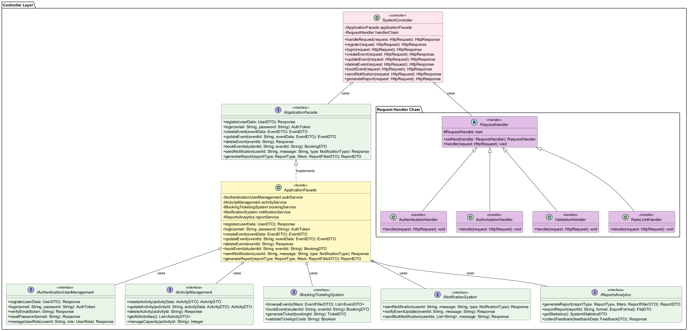
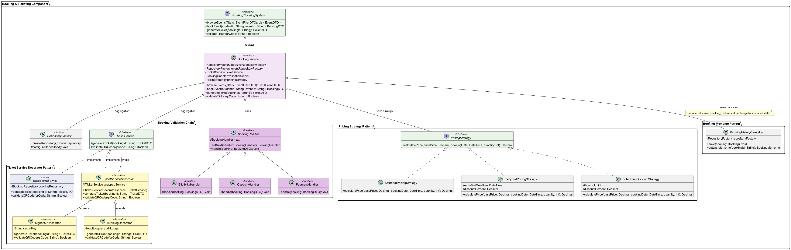
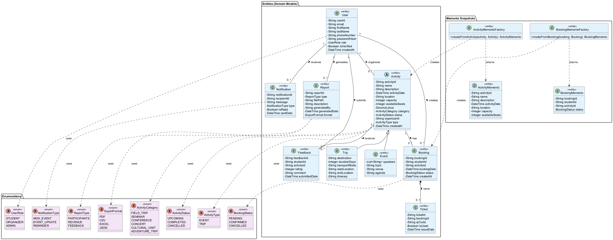

## Command

- **Controller Command Pattern (Controller Layer)**

  - Participants: `IControllerCommand` (command), concrete commands: `RegisterCommand`, `LoginCommand`, `CreateEventCommand`, `UpdateEventCommand`, `DeleteEventCommand`, `BookEventCommand`, `SendNotificationCommand`, `GenerateReportCommand`; `ControllerCommandInvoker` (invoker).
  - Context: `SystemController` delegates to `ControllerCommandInvoker`, which maps route names to commands and executes them.
  - Diagram:

    

---

## Strategy

- **Pricing Strategy (Booking & Ticketing)**

  - Participants: `PricingStrategy` (strategy), `StandardPricingStrategy`, `EarlyBirdPricingStrategy`, `BulkGroupDiscountStrategy`.
  - Context: `BookingService` depends on a `PricingStrategy` to compute prices based on context (date/quantity/discounts).
  - Diagram:

    

---

## State

- **Activity Lifecycle State (Activity Layer)**

  - Participants: `ActivityState` (state), concrete states: `UpcomingState`, `CompletedState`, `CancelledState`; `ActivityLifecycle` (context).
  - Context: `ActivityLifecycle` holds current `ActivityState` and delegates `publish/complete/cancel` behavior to the state.
  - Diagram:

    

---

## Memento

- **Activity History (Activity Layer + Data Layer)**

  - Participants: `ActivityMemento`, `ActivityMementoFactory` (memento creation), `ActivityHistoryCaretaker` (caretaker), `Activity` (originator via factory usage).
  - Context: Snapshots of `Activity` state are saved and retrieved to support undo/history.
  - Diagrams:

    

    

- **Booking History (Booking & Ticketing + Data Layer)**

  - Participants: `BookingMemento`, `BookingMementoFactory`, `BookingHistoryCaretaker`, `Booking` (originator via factory usage).
  - Context: `BookingService` saves a snapshot before status changes, enabling rollback/history.
  - Diagram:

    
