# University Trips & Events Management System
## Behavioral Design Patterns Report

This report documents the application of behavioral design patterns to the AIU Trips & Events Management System, following SOLID principles with emphasis on Dependency Inversion and loose coupling.

---

## Table of Contents

1. [Command Pattern](#1-command-pattern)
2. [Mediator Pattern](#2-mediator-pattern)
3. [Memento Pattern](#3-memento-pattern)
4. [Observer Pattern](#4-observer-pattern)
5. [Interpreter Pattern](#5-interpreter-pattern)
6. [State Pattern](#6-state-pattern)
7. [Strategy Pattern](#7-strategy-pattern)
8. [Null Object Pattern](#8-null-object-pattern)
9. [Template Method Pattern](#9-template-method-pattern)
10. [Object Authenticator Pattern](#10-object-authenticator-pattern)
11. [Complete System Architecture](#11-complete-system-architecture)
12. [SOLID Principles Summary](#12-solid-principles-summary)

---

## 1. Command Pattern

The Command Pattern encapsulates booking and event operations as objects, enabling undo/redo functionality, queuing, and logging.

### Benefits
- **Decouples** the invoker from the receiver
- Supports **undo/redo** operations
- Enables **command queuing** and logging
- Follows **Single Responsibility Principle**

### PlantUML Diagram

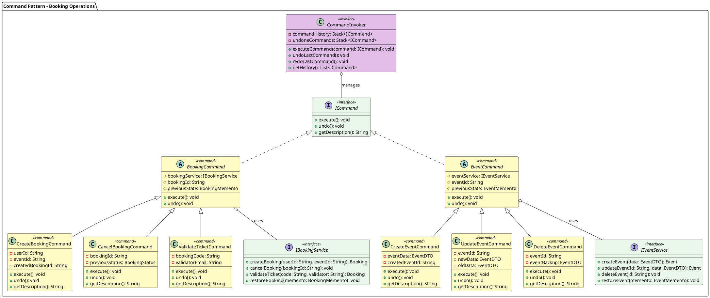

---

## 2. Mediator Pattern

The Mediator Pattern coordinates communication between services, reducing direct dependencies and promoting loose coupling.

### Benefits
- **Centralizes** complex communications
- **Reduces coupling** between components
- Simplifies **maintenance** and testing
- Follows **Open/Closed Principle**

### PlantUML Diagram

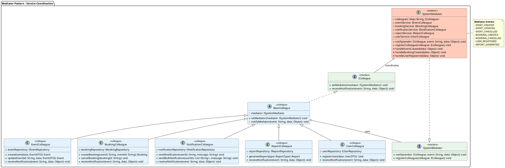

---

## 3. Memento Pattern

The Memento Pattern captures and restores object state, enabling undo functionality for events and bookings.

### Benefits
- Preserves **encapsulation** boundaries
- Provides **state restoration** capability
- Supports **undo/redo** operations
- Follows **Single Responsibility Principle**

### PlantUML Diagram

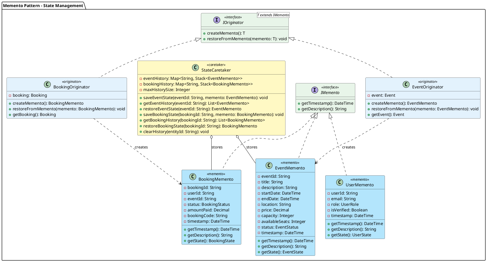

---

## 4. Observer Pattern

The Observer Pattern implements the notification system, allowing subscribers to receive updates about events.

### Benefits
- **Decouples** publishers from subscribers
- Supports **dynamic subscription**
- Enables **broadcast communication**
- Follows **Open/Closed Principle**

### PlantUML Diagram

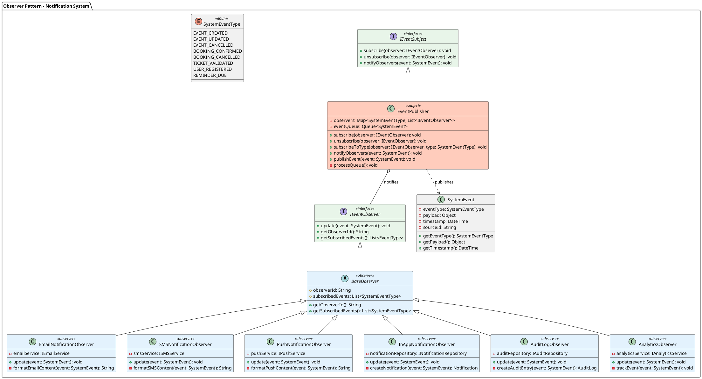

---

## 5. Interpreter Pattern

The Interpreter Pattern enables parsing and executing search/filter queries for events and bookings.

### Benefits
- Provides **flexible query language**
- Supports **complex search criteria**
- Enables **extensible expressions**
- Follows **Open/Closed Principle**

### PlantUML Diagram

```plantuml
@startuml Interpreter_Pattern

!define INTERFACE_COLOR #E8F5E9
!define EXPRESSION_COLOR #FFF9C4
!define CONTEXT_COLOR #E3F2FD

skinparam class {
    BackgroundColor<<interface>> INTERFACE_COLOR
    BackgroundColor<<expression>> EXPRESSION_COLOR
    BackgroundColor<<context>> CONTEXT_COLOR
}

package "Interpreter Pattern - Search Query System" {

    class SearchContext <<context>> {
        -events: List<Event>
        -bookings: List<Booking>
        -parameters: Map<String, Object>
        +getEvents(): List<Event>
        +getBookings(): List<Booking>
        +setParameter(key: String, value: Object): void
        +getParameter(key: String): Object
    }

    interface ISearchExpression <<interface>> {
        +interpret(context: SearchContext): List<Object>
        +getExpressionType(): String
    }

    abstract class BaseExpression <<expression>> {
        #expressionType: String
        +getExpressionType(): String
    }

    class EventTypeExpression <<expression>> {
        -eventType: EventType
        +interpret(context: SearchContext): List<Event>
    }

    class DateRangeExpression <<expression>> {
        -startDate: DateTime
        -endDate: DateTime
        +interpret(context: SearchContext): List<Event>
    }

    class PriceRangeExpression <<expression>> {
        -minPrice: Decimal
        -maxPrice: Decimal
        +interpret(context: SearchContext): List<Event>
    }

    class LocationExpression <<expression>> {
        -location: String
        -exactMatch: Boolean
        +interpret(context: SearchContext): List<Event>
    }

    class CapacityExpression <<expression>> {
        -minSeats: Integer
        +interpret(context: SearchContext): List<Event>
    }

    class StatusExpression <<expression>> {
        -status: EventStatus
        +interpret(context: SearchContext): List<Event>
    }

    class AndExpression <<expression>> {
        -left: ISearchExpression
        -right: ISearchExpression
        +interpret(context: SearchContext): List<Object>
    }

    class OrExpression <<expression>> {
        -left: ISearchExpression
        -right: ISearchExpression
        +interpret(context: SearchContext): List<Object>
    }

    class NotExpression <<expression>> {
        -expression: ISearchExpression
        +interpret(context: SearchContext): List<Object>
    }

    class QueryParser {
        +parse(query: String): ISearchExpression
        -tokenize(query: String): List<Token>
        -buildExpression(tokens: List<Token>): ISearchExpression
    }

    class SearchService {
        -queryParser: QueryParser
        -eventRepository: IEventRepository
        +search(query: String): List<Event>
        +advancedSearch(expression: ISearchExpression): List<Event>
    }

    ISearchExpression <|.. BaseExpression
    BaseExpression <|-- EventTypeExpression
    BaseExpression <|-- DateRangeExpression
    BaseExpression <|-- PriceRangeExpression
    BaseExpression <|-- LocationExpression
    BaseExpression <|-- CapacityExpression
    BaseExpression <|-- StatusExpression
    BaseExpression <|-- AndExpression
    BaseExpression <|-- OrExpression
    BaseExpression <|-- NotExpression

    AndExpression o-- ISearchExpression : left
    AndExpression o-- ISearchExpression : right
    OrExpression o-- ISearchExpression : left
    OrExpression o-- ISearchExpression : right
    NotExpression o-- ISearchExpression : wraps

    SearchService o-- QueryParser : uses
    QueryParser ..> ISearchExpression : creates
}

note bottom of QueryParser
  **Example Queries:**
  - "type:TRIP AND price:<100"
  - "location:Cairo OR location:Alex"
  - "date:2024-01-01..2024-12-31 AND available:>10"
end note

@enduml
```

---

## 6. State Pattern

The State Pattern manages event and booking lifecycle states, enabling clean state transitions.

### Benefits
- **Encapsulates** state-specific behavior
- Eliminates **complex conditionals**
- Makes state transitions **explicit**
- Follows **Single Responsibility Principle**

### PlantUML Diagram

```plantuml
@startuml State_Pattern

!define INTERFACE_COLOR #E8F5E9
!define STATE_COLOR #C8E6C9
!define CONTEXT_COLOR #E3F2FD

skinparam class {
    BackgroundColor<<interface>> INTERFACE_COLOR
    BackgroundColor<<state>> STATE_COLOR
    BackgroundColor<<context>> CONTEXT_COLOR
}

package "State Pattern - Event Lifecycle" {

    interface IEventState <<interface>> {
        +publish(context: EventContext): void
        +cancel(context: EventContext): void
        +complete(context: EventContext): void
        +archive(context: EventContext): void
        +getStateName(): String
        +getAllowedTransitions(): List<String>
    }

    class EventContext <<context>> {
        -event: Event
        -currentState: IEventState
        -stateHistory: List<IEventState>
        +setState(state: IEventState): void
        +getState(): IEventState
        +publish(): void
        +cancel(): void
        +complete(): void
        +archive(): void
        +getEvent(): Event
    }

    class DraftState <<state>> {
        +publish(context: EventContext): void
        +cancel(context: EventContext): void
        +complete(context: EventContext): void
        +archive(context: EventContext): void
        +getStateName(): String
        +getAllowedTransitions(): List<String>
    }

    class PublishedState <<state>> {
        +publish(context: EventContext): void
        +cancel(context: EventContext): void
        +complete(context: EventContext): void
        +archive(context: EventContext): void
        +getStateName(): String
        +getAllowedTransitions(): List<String>
    }

    class CancelledState <<state>> {
        +publish(context: EventContext): void
        +cancel(context: EventContext): void
        +complete(context: EventContext): void
        +archive(context: EventContext): void
        +getStateName(): String
        +getAllowedTransitions(): List<String>
    }

    class CompletedState <<state>> {
        +publish(context: EventContext): void
        +cancel(context: EventContext): void
        +complete(context: EventContext): void
        +archive(context: EventContext): void
        +getStateName(): String
        +getAllowedTransitions(): List<String>
    }

    class ArchivedState <<state>> {
        +publish(context: EventContext): void
        +cancel(context: EventContext): void
        +complete(context: EventContext): void
        +archive(context: EventContext): void
        +getStateName(): String
        +getAllowedTransitions(): List<String>
    }

    IEventState <|.. DraftState
    IEventState <|.. PublishedState
    IEventState <|.. CancelledState
    IEventState <|.. CompletedState
    IEventState <|.. ArchivedState

    EventContext o-- IEventState : currentState
}

package "State Pattern - Booking Lifecycle" {

    interface IBookingState <<interface>> {
        +confirm(context: BookingContext): void
        +cancel(context: BookingContext): void
        +attend(context: BookingContext): void
        +refund(context: BookingContext): void
        +getStateName(): String
    }

    class BookingContext <<context>> {
        -booking: Booking
        -currentState: IBookingState
        +setState(state: IBookingState): void
        +getState(): IBookingState
        +confirm(): void
        +cancel(): void
        +attend(): void
        +refund(): void
    }

    class PendingBookingState <<state>> {
        +confirm(context: BookingContext): void
        +cancel(context: BookingContext): void
        +attend(context: BookingContext): void
        +refund(context: BookingContext): void
        +getStateName(): String
    }

    class ConfirmedBookingState <<state>> {
        +confirm(context: BookingContext): void
        +cancel(context: BookingContext): void
        +attend(context: BookingContext): void
        +refund(context: BookingContext): void
        +getStateName(): String
    }

    class CancelledBookingState <<state>> {
        +confirm(context: BookingContext): void
        +cancel(context: BookingContext): void
        +attend(context: BookingContext): void
        +refund(context: BookingContext): void
        +getStateName(): String
    }

    class AttendedBookingState <<state>> {
        +confirm(context: BookingContext): void
        +cancel(context: BookingContext): void
        +attend(context: BookingContext): void
        +refund(context: BookingContext): void
        +getStateName(): String
    }

    class RefundedBookingState <<state>> {
        +confirm(context: BookingContext): void
        +cancel(context: BookingContext): void
        +attend(context: BookingContext): void
        +refund(context: BookingContext): void
        +getStateName(): String
    }

    IBookingState <|.. PendingBookingState
    IBookingState <|.. ConfirmedBookingState
    IBookingState <|.. CancelledBookingState
    IBookingState <|.. AttendedBookingState
    IBookingState <|.. RefundedBookingState

    BookingContext o-- IBookingState : currentState
}

@enduml
```

---

## 7. Strategy Pattern

The Strategy Pattern enables interchangeable algorithms for pricing, validation, and export operations.

### Benefits
- **Encapsulates** algorithms
- Enables **runtime switching**
- Eliminates **conditional statements**
- Follows **Open/Closed Principle**

### PlantUML Diagram

```plantuml
@startuml Strategy_Pattern

!define INTERFACE_COLOR #E8F5E9
!define STRATEGY_COLOR #FFE0B2
!define CONTEXT_COLOR #E3F2FD

skinparam class {
    BackgroundColor<<interface>> INTERFACE_COLOR
    BackgroundColor<<strategy>> STRATEGY_COLOR
    BackgroundColor<<context>> CONTEXT_COLOR
}

package "Strategy Pattern - Pricing Strategies" {

    interface IPricingStrategy <<interface>> {
        +calculatePrice(basePrice: Decimal, context: PricingContext): Decimal
        +getStrategyName(): String
        +getDescription(): String
    }

    class PricingContext <<context>> {
        -user: User
        -event: Event
        -bookingDate: DateTime
        -quantity: Integer
        +getUser(): User
        +getEvent(): Event
        +getBookingDate(): DateTime
    }

    class RegularPricingStrategy <<strategy>> {
        +calculatePrice(basePrice: Decimal, context: PricingContext): Decimal
        +getStrategyName(): String
    }

    class EarlyBirdPricingStrategy <<strategy>> {
        -discountPercentage: Decimal
        -daysBeforeEvent: Integer
        +calculatePrice(basePrice: Decimal, context: PricingContext): Decimal
        +getStrategyName(): String
    }

    class StudentDiscountStrategy <<strategy>> {
        -discountPercentage: Decimal
        +calculatePrice(basePrice: Decimal, context: PricingContext): Decimal
        +getStrategyName(): String
    }

    class GroupDiscountStrategy <<strategy>> {
        -minGroupSize: Integer
        -discountPercentage: Decimal
        +calculatePrice(basePrice: Decimal, context: PricingContext): Decimal
        +getStrategyName(): String
    }

    class PromotionalStrategy <<strategy>> {
        -promoCode: String
        -discountAmount: Decimal
        +calculatePrice(basePrice: Decimal, context: PricingContext): Decimal
        +getStrategyName(): String
    }

    class PricingService <<context>> {
        -strategy: IPricingStrategy
        -strategyRegistry: Map<String, IPricingStrategy>
        +setStrategy(strategy: IPricingStrategy): void
        +calculateFinalPrice(basePrice: Decimal, context: PricingContext): Decimal
        +registerStrategy(name: String, strategy: IPricingStrategy): void
    }

    IPricingStrategy <|.. RegularPricingStrategy
    IPricingStrategy <|.. EarlyBirdPricingStrategy
    IPricingStrategy <|.. StudentDiscountStrategy
    IPricingStrategy <|.. GroupDiscountStrategy
    IPricingStrategy <|.. PromotionalStrategy

    PricingService o-- IPricingStrategy : uses
}

package "Strategy Pattern - Validation Strategies" {

    interface IValidationStrategy <<interface>> {
        +validate(booking: Booking): ValidationResult
        +getValidationType(): String
    }

    class ValidationResult {
        -isValid: Boolean
        -errors: List<String>
        -warnings: List<String>
        +isValid(): Boolean
        +getErrors(): List<String>
    }

    class CapacityValidationStrategy <<strategy>> {
        +validate(booking: Booking): ValidationResult
        +getValidationType(): String
    }

    class EligibilityValidationStrategy <<strategy>> {
        +validate(booking: Booking): ValidationResult
        +getValidationType(): String
    }

    class PaymentValidationStrategy <<strategy>> {
        +validate(booking: Booking): ValidationResult
        +getValidationType(): String
    }

    class TimeValidationStrategy <<strategy>> {
        +validate(booking: Booking): ValidationResult
        +getValidationType(): String
    }

    class CompositeValidationStrategy <<strategy>> {
        -strategies: List<IValidationStrategy>
        +addStrategy(strategy: IValidationStrategy): void
        +validate(booking: Booking): ValidationResult
        +getValidationType(): String
    }

    IValidationStrategy <|.. CapacityValidationStrategy
    IValidationStrategy <|.. EligibilityValidationStrategy
    IValidationStrategy <|.. PaymentValidationStrategy
    IValidationStrategy <|.. TimeValidationStrategy
    IValidationStrategy <|.. CompositeValidationStrategy

    CompositeValidationStrategy o-- IValidationStrategy : contains
}

package "Strategy Pattern - Export Strategies" {

    interface IExportStrategy <<interface>> {
        +export(data: ReportData): FileDTO
        +getFormat(): String
        +getMimeType(): String
    }

    class PDFExportStrategy <<strategy>> {
        +export(data: ReportData): FileDTO
        +getFormat(): String
        +getMimeType(): String
    }

    class CSVExportStrategy <<strategy>> {
        +export(data: ReportData): FileDTO
        +getFormat(): String
        +getMimeType(): String
    }

    class ExcelExportStrategy <<strategy>> {
        +export(data: ReportData): FileDTO
        +getFormat(): String
        +getMimeType(): String
    }

    class JSONExportStrategy <<strategy>> {
        +export(data: ReportData): FileDTO
        +getFormat(): String
        +getMimeType(): String
    }

    IExportStrategy <|.. PDFExportStrategy
    IExportStrategy <|.. CSVExportStrategy
    IExportStrategy <|.. ExcelExportStrategy
    IExportStrategy <|.. JSONExportStrategy
}

@enduml
```

---

## 8. Null Object Pattern

The Null Object Pattern provides default behavior for missing or optional objects, eliminating null checks.

### Benefits
- Eliminates **null checks**
- Provides **default behavior**
- Simplifies **client code**
- Follows **Liskov Substitution Principle**

### PlantUML Diagram

```plantuml
@startuml Null_Object_Pattern

!define INTERFACE_COLOR #E8F5E9
!define REAL_COLOR #E3F2FD
!define NULL_COLOR #FFCDD2

skinparam class {
    BackgroundColor<<interface>> INTERFACE_COLOR
    BackgroundColor<<real>> REAL_COLOR
    BackgroundColor<<null>> NULL_COLOR
}

package "Null Object Pattern - User" {

    interface IUser <<interface>> {
        +getId(): String
        +getEmail(): String
        +getName(): String
        +getRole(): UserRole
        +isAuthenticated(): Boolean
        +hasPermission(permission: String): Boolean
    }

    class RealUser <<real>> {
        -id: String
        -email: String
        -name: String
        -role: UserRole
        -permissions: Set<String>
        +getId(): String
        +getEmail(): String
        +getName(): String
        +getRole(): UserRole
        +isAuthenticated(): Boolean
        +hasPermission(permission: String): Boolean
    }

    class NullUser <<null>> {
        +getId(): String
        +getEmail(): String
        +getName(): String
        +getRole(): UserRole
        +isAuthenticated(): Boolean
        +hasPermission(permission: String): Boolean
    }

    class GuestUser <<null>> {
        +getId(): String
        +getEmail(): String
        +getName(): String
        +getRole(): UserRole
        +isAuthenticated(): Boolean
        +hasPermission(permission: String): Boolean
    }

    IUser <|.. RealUser
    IUser <|.. NullUser
    IUser <|.. GuestUser
}

package "Null Object Pattern - Notification" {

    interface INotificationChannel <<interface>> {
        +send(recipient: String, message: String): Response
        +isEnabled(): Boolean
        +getChannelType(): String
    }

    class EmailChannel <<real>> {
        -emailService: IEmailService
        +send(recipient: String, message: String): Response
        +isEnabled(): Boolean
        +getChannelType(): String
    }

    class SMSChannel <<real>> {
        -smsService: ISMSService
        +send(recipient: String, message: String): Response
        +isEnabled(): Boolean
        +getChannelType(): String
    }

    class NullNotificationChannel <<null>> {
        +send(recipient: String, message: String): Response
        +isEnabled(): Boolean
        +getChannelType(): String
    }

    INotificationChannel <|.. EmailChannel
    INotificationChannel <|.. SMSChannel
    INotificationChannel <|.. NullNotificationChannel
}

package "Null Object Pattern - Logger" {

    interface ILogger <<interface>> {
        +log(level: LogLevel, message: String): void
        +info(message: String): void
        +warn(message: String): void
        +error(message: String): void
        +debug(message: String): void
    }

    class ConsoleLogger <<real>> {
        +log(level: LogLevel, message: String): void
        +info(message: String): void
        +warn(message: String): void
        +error(message: String): void
        +debug(message: String): void
    }

    class FileLogger <<real>> {
        -filePath: String
        +log(level: LogLevel, message: String): void
        +info(message: String): void
        +warn(message: String): void
        +error(message: String): void
        +debug(message: String): void
    }

    class NullLogger <<null>> {
        +log(level: LogLevel, message: String): void
        +info(message: String): void
        +warn(message: String): void
        +error(message: String): void
        +debug(message: String): void
    }

    ILogger <|.. ConsoleLogger
    ILogger <|.. FileLogger
    ILogger <|.. NullLogger
}

package "Null Object Pattern - Event" {

    interface IEvent <<interface>> {
        +getId(): String
        +getTitle(): String
        +getDescription(): String
        +isAvailable(): Boolean
        +getAvailableSeats(): Integer
    }

    class RealEvent <<real>> {
        -id: String
        -title: String
        -description: String
        -availableSeats: Integer
        +getId(): String
        +getTitle(): String
        +getDescription(): String
        +isAvailable(): Boolean
        +getAvailableSeats(): Integer
    }

    class NullEvent <<null>> {
        +getId(): String
        +getTitle(): String
        +getDescription(): String
        +isAvailable(): Boolean
        +getAvailableSeats(): Integer
    }

    IEvent <|.. RealEvent
    IEvent <|.. NullEvent
}

note right of NullUser
  **NullUser Returns:**
  - getId(): "guest"
  - getEmail(): ""
  - getName(): "Guest"
  - getRole(): GUEST
  - isAuthenticated(): false
  - hasPermission(): false
end note

note right of NullNotificationChannel
  **NullNotificationChannel:**
  - send(): Returns success response
  - isEnabled(): false
  - Does nothing (silent operation)
end note

note right of NullLogger
  **NullLogger:**
  - All methods do nothing
  - Used when logging is disabled
  - Safe to call anywhere
end note

@enduml
```

---

## 9. Template Method Pattern

The Template Method Pattern defines workflow skeletons with customizable steps for processing events and reports.

### Benefits
- Defines **algorithm skeleton**
- Enables **step customization**
- Promotes **code reuse**
- Follows **Hollywood Principle** (Don't call us, we'll call you)

### PlantUML Diagram

```plantuml
@startuml Template_Method_Pattern

!define INTERFACE_COLOR #E8F5E9
!define ABSTRACT_COLOR #FFF3E0
!define CONCRETE_COLOR #E3F2FD

skinparam class {
    BackgroundColor<<interface>> INTERFACE_COLOR
    BackgroundColor<<abstract>> ABSTRACT_COLOR
    BackgroundColor<<concrete>> CONCRETE_COLOR
}

package "Template Method Pattern - Booking Workflow" {

    abstract class BookingWorkflow <<abstract>> {
        +processBooking(userId: String, eventId: String): Booking
        #validateUser(userId: String): User
        #{abstract} validateEvent(eventId: String): Event
        #{abstract} checkAvailability(event: Event): Boolean
        #{abstract} calculatePrice(event: Event, user: User): Decimal
        #{abstract} processPayment(amount: Decimal, user: User): PaymentResult
        #createBookingRecord(user: User, event: Event): Booking
        #generateTicket(booking: Booking): Ticket
        #{abstract} sendConfirmation(booking: Booking): void
        #handleError(error: Exception): void
    }

    class StandardBookingWorkflow <<concrete>> {
        +validateEvent(eventId: String): Event
        +checkAvailability(event: Event): Boolean
        +calculatePrice(event: Event, user: User): Decimal
        +processPayment(amount: Decimal, user: User): PaymentResult
        +sendConfirmation(booking: Booking): void
    }

    class VIPBookingWorkflow <<concrete>> {
        -vipService: IVIPService
        +validateEvent(eventId: String): Event
        +checkAvailability(event: Event): Boolean
        +calculatePrice(event: Event, user: User): Decimal
        +processPayment(amount: Decimal, user: User): PaymentResult
        +sendConfirmation(booking: Booking): void
        +assignVIPSeating(booking: Booking): void
    }

    class GroupBookingWorkflow <<concrete>> {
        -groupSize: Integer
        +validateEvent(eventId: String): Event
        +checkAvailability(event: Event): Boolean
        +calculatePrice(event: Event, user: User): Decimal
        +processPayment(amount: Decimal, user: User): PaymentResult
        +sendConfirmation(booking: Booking): void
    }

    BookingWorkflow <|-- StandardBookingWorkflow
    BookingWorkflow <|-- VIPBookingWorkflow
    BookingWorkflow <|-- GroupBookingWorkflow
}

package "Template Method Pattern - Report Generation" {

    abstract class ReportGenerator <<abstract>> {
        +generateReport(filters: ReportFilterDTO): Report
        #{abstract} gatherData(filters: ReportFilterDTO): List<Object>
        #{abstract} processData(data: List<Object>): ProcessedData
        #{abstract} formatReport(data: ProcessedData): Report
        #validateFilters(filters: ReportFilterDTO): Boolean
        #saveReport(report: Report): void
        #{abstract} getReportType(): ReportType
    }

    class ParticipantsReportGenerator <<concrete>> {
        +gatherData(filters: ReportFilterDTO): List<Object>
        +processData(data: List<Object>): ProcessedData
        +formatReport(data: ProcessedData): Report
        +getReportType(): ReportType
    }

    class RevenueReportGenerator <<concrete>> {
        +gatherData(filters: ReportFilterDTO): List<Object>
        +processData(data: List<Object>): ProcessedData
        +formatReport(data: ProcessedData): Report
        +getReportType(): ReportType
        -calculateTotals(data: List<Object>): RevenueSummary
    }

    class FeedbackReportGenerator <<concrete>> {
        +gatherData(filters: ReportFilterDTO): List<Object>
        +processData(data: List<Object>): ProcessedData
        +formatReport(data: ProcessedData): Report
        +getReportType(): ReportType
        -calculateAverages(data: List<Object>): FeedbackSummary
    }

    class AttendanceReportGenerator <<concrete>> {
        +gatherData(filters: ReportFilterDTO): List<Object>
        +processData(data: List<Object>): ProcessedData
        +formatReport(data: ProcessedData): Report
        +getReportType(): ReportType
    }

    ReportGenerator <|-- ParticipantsReportGenerator
    ReportGenerator <|-- RevenueReportGenerator
    ReportGenerator <|-- FeedbackReportGenerator
    ReportGenerator <|-- AttendanceReportGenerator
}

package "Template Method Pattern - Event Processing" {

    abstract class EventProcessor <<abstract>> {
        +processEvent(eventData: EventDTO): Event
        #{abstract} validateEventData(data: EventDTO): Boolean
        #{abstract} enrichEventData(data: EventDTO): EventDTO
        #createEvent(data: EventDTO): Event
        #{abstract} postProcessEvent(event: Event): void
        #{abstract} notifyStakeholders(event: Event): void
    }

    class TripProcessor <<concrete>> {
        +validateEventData(data: EventDTO): Boolean
        +enrichEventData(data: EventDTO): EventDTO
        +postProcessEvent(event: Event): void
        +notifyStakeholders(event: Event): void
        -validateTransportation(data: EventDTO): Boolean
    }

    class ConferenceProcessor <<concrete>> {
        +validateEventData(data: EventDTO): Boolean
        +enrichEventData(data: EventDTO): EventDTO
        +postProcessEvent(event: Event): void
        +notifyStakeholders(event: Event): void
        -setupSessions(event: Event): void
    }

    class SeminarProcessor <<concrete>> {
        +validateEventData(data: EventDTO): Boolean
        +enrichEventData(data: EventDTO): EventDTO
        +postProcessEvent(event: Event): void
        +notifyStakeholders(event: Event): void
    }

    EventProcessor <|-- TripProcessor
    EventProcessor <|-- ConferenceProcessor
    EventProcessor <|-- SeminarProcessor
}

note right of BookingWorkflow
  **Template Method Steps:**
  1. validateUser() - common
  2. validateEvent() - abstract
  3. checkAvailability() - abstract
  4. calculatePrice() - abstract
  5. processPayment() - abstract
  6. createBookingRecord() - common
  7. generateTicket() - common
  8. sendConfirmation() - abstract
end note

@enduml
```

---

## 10. Object Authenticator Pattern

The Object Authenticator Pattern provides flexible authentication mechanisms with support for multiple authentication methods.

### Benefits
- Supports **multiple auth methods**
- Enables **authentication chaining**
- Provides **security layers**
- Follows **Single Responsibility Principle**

### PlantUML Diagram

```plantuml
@startuml Object_Authenticator_Pattern

!define INTERFACE_COLOR #E8F5E9
!define AUTH_COLOR #FFCCBC
!define PROVIDER_COLOR #E3F2FD
!define TOKEN_COLOR #FFF9C4

skinparam class {
    BackgroundColor<<interface>> INTERFACE_COLOR
    BackgroundColor<<authenticator>> AUTH_COLOR
    BackgroundColor<<provider>> PROVIDER_COLOR
    BackgroundColor<<token>> TOKEN_COLOR
}

package "Object Authenticator Pattern" {

    interface IAuthenticator <<interface>> {
        +authenticate(credentials: ICredentials): AuthResult
        +supports(credentialType: String): Boolean
        +getAuthenticatorType(): String
    }

    interface ICredentials <<interface>> {
        +getCredentialType(): String
        +isValid(): Boolean
    }

    class AuthResult <<token>> {
        -authenticated: Boolean
        -user: IUser
        -token: AuthToken
        -errors: List<String>
        -expiresAt: DateTime
        +isAuthenticated(): Boolean
        +getUser(): IUser
        +getToken(): AuthToken
        +getErrors(): List<String>
    }

    class AuthToken <<token>> {
        -tokenValue: String
        -userId: String
        -role: UserRole
        -issuedAt: DateTime
        -expiresAt: DateTime
        -claims: Map<String, Object>
        +isExpired(): Boolean
        +getClaim(key: String): Object
    }

    class UsernamePasswordCredentials <<provider>> {
        -username: String
        -password: String
        +getCredentialType(): String
        +isValid(): Boolean
    }

    class JWTCredentials <<provider>> {
        -token: String
        +getCredentialType(): String
        +isValid(): Boolean
    }

    class OAuth2Credentials <<provider>> {
        -accessToken: String
        -provider: String
        +getCredentialType(): String
        +isValid(): Boolean
    }

    class APIKeyCredentials <<provider>> {
        -apiKey: String
        -apiSecret: String
        +getCredentialType(): String
        +isValid(): Boolean
    }

    class UsernamePasswordAuthenticator <<authenticator>> {
        -userRepository: IUserRepository
        -passwordEncoder: IPasswordEncoder
        -tokenService: ITokenService
        +authenticate(credentials: ICredentials): AuthResult
        +supports(credentialType: String): Boolean
        +getAuthenticatorType(): String
    }

    class JWTAuthenticator <<authenticator>> {
        -jwtService: IJWTService
        -userRepository: IUserRepository
        +authenticate(credentials: ICredentials): AuthResult
        +supports(credentialType: String): Boolean
        +getAuthenticatorType(): String
        -validateToken(token: String): Claims
    }

    class OAuth2Authenticator <<authenticator>> {
        -oauth2ProviderRegistry: Map<String, IOAuth2Provider>
        -userRepository: IUserRepository
        +authenticate(credentials: ICredentials): AuthResult
        +supports(credentialType: String): Boolean
        +getAuthenticatorType(): String
        +registerProvider(name: String, provider: IOAuth2Provider): void
    }

    class APIKeyAuthenticator <<authenticator>> {
        -apiKeyRepository: IAPIKeyRepository
        +authenticate(credentials: ICredentials): AuthResult
        +supports(credentialType: String): Boolean
        +getAuthenticatorType(): String
    }

    class ChainedAuthenticator <<authenticator>> {
        -authenticators: List<IAuthenticator>
        +authenticate(credentials: ICredentials): AuthResult
        +supports(credentialType: String): Boolean
        +getAuthenticatorType(): String
        +addAuthenticator(authenticator: IAuthenticator): void
    }

    class AuthenticationManager {
        -authenticators: Map<String, IAuthenticator>
        -defaultAuthenticator: IAuthenticator
        +authenticate(credentials: ICredentials): AuthResult
        +registerAuthenticator(authenticator: IAuthenticator): void
        +setDefaultAuthenticator(authenticator: IAuthenticator): void
        -selectAuthenticator(credentials: ICredentials): IAuthenticator
    }

    interface ITokenService <<interface>> {
        +generateToken(user: IUser): AuthToken
        +validateToken(token: String): Boolean
        +refreshToken(token: AuthToken): AuthToken
        +revokeToken(token: AuthToken): void
    }

    interface IPasswordEncoder <<interface>> {
        +encode(rawPassword: String): String
        +matches(rawPassword: String, encodedPassword: String): Boolean
    }

    ICredentials <|.. UsernamePasswordCredentials
    ICredentials <|.. JWTCredentials
    ICredentials <|.. OAuth2Credentials
    ICredentials <|.. APIKeyCredentials

    IAuthenticator <|.. UsernamePasswordAuthenticator
    IAuthenticator <|.. JWTAuthenticator
    IAuthenticator <|.. OAuth2Authenticator
    IAuthenticator <|.. APIKeyAuthenticator
    IAuthenticator <|.. ChainedAuthenticator

    ChainedAuthenticator o-- IAuthenticator : contains
    AuthenticationManager o-- IAuthenticator : manages

    UsernamePasswordAuthenticator o-- IPasswordEncoder : uses
    UsernamePasswordAuthenticator o-- ITokenService : uses
    JWTAuthenticator o-- ITokenService : uses
}

note right of ChainedAuthenticator
  **Authentication Chain:**
  1. Try JWT first (fastest)
  2. Try API Key
  3. Try Username/Password
  4. Try OAuth2
  
  Stops on first success
end note

note right of AuthenticationManager
  **Manager Responsibilities:**
  - Route credentials to correct authenticator
  - Manage authenticator registry
  - Handle authentication failures
  - Provide fallback mechanisms
end note

@enduml
```

---

## 11. Complete System Architecture

This diagram shows how all behavioral patterns integrate into the complete system.

### PlantUML Diagram

```plantuml
@startuml Complete_Behavioral_System

!define INTERFACE_COLOR #E8F5E9
!define SERVICE_COLOR #F3E5F5
!define PATTERN_COLOR #FFF9C4
!define ENTITY_COLOR #E3F2FD

skinparam class {
    BackgroundColor<<interface>> INTERFACE_COLOR
    BackgroundColor<<service>> SERVICE_COLOR
    BackgroundColor<<pattern>> PATTERN_COLOR
    BackgroundColor<<entity>> ENTITY_COLOR
}

title University Trips & Events - Behavioral Patterns Integration

package "Controller Layer" {
    class SystemController {
        -facade: IApplicationFacade
        -authManager: AuthenticationManager
        -commandInvoker: CommandInvoker
    }
}

package "Facade Layer" {
    interface IApplicationFacade <<interface>>
    class ApplicationFacade <<service>> {
        -mediator: ISystemMediator
        -eventPublisher: EventPublisher
    }
}

package "Command Pattern" <<pattern>> {
    class CommandInvoker <<pattern>>
    interface ICommand <<interface>>
    class CreateBookingCommand <<pattern>>
    class CreateEventCommand <<pattern>>
}

package "Mediator Pattern" <<pattern>> {
    interface ISystemMediator <<interface>>
    class SystemMediator <<pattern>>
    interface IColleague <<interface>>
}

package "Observer Pattern" <<pattern>> {
    class EventPublisher <<pattern>>
    interface IEventObserver <<interface>>
    class EmailNotificationObserver <<pattern>>
    class InAppNotificationObserver <<pattern>>
}

package "State Pattern" <<pattern>> {
    interface IEventState <<interface>>
    class EventContext <<pattern>>
    interface IBookingState <<interface>>
    class BookingContext <<pattern>>
}

package "Strategy Pattern" <<pattern>> {
    interface IPricingStrategy <<interface>>
    interface IValidationStrategy <<interface>>
    interface IExportStrategy <<interface>>
    class PricingService <<pattern>>
}

package "Template Method Pattern" <<pattern>> {
    abstract class BookingWorkflow <<pattern>>
    abstract class ReportGenerator <<pattern>>
}

package "Memento Pattern" <<pattern>> {
    class StateCaretaker <<pattern>>
    interface IMemento <<interface>>
}

package "Interpreter Pattern" <<pattern>> {
    interface ISearchExpression <<interface>>
    class SearchService <<pattern>>
    class QueryParser <<pattern>>
}

package "Null Object Pattern" <<pattern>> {
    interface IUser <<interface>>
    class NullUser <<pattern>>
    interface ILogger <<interface>>
    class NullLogger <<pattern>>
}

package "Authenticator Pattern" <<pattern>> {
    class AuthenticationManager <<pattern>>
    interface IAuthenticator <<interface>>
    class ChainedAuthenticator <<pattern>>
}

package "Service Layer" {
    class EventService <<service>>
    class BookingService <<service>>
    class NotificationService <<service>>
    class ReportService <<service>>
    class UserService <<service>>
}

package "Data Layer" {
    class Event <<entity>>
    class Booking <<entity>>
    class User <<entity>>
    class Notification <<entity>>
}

' Relationships
SystemController o-- IApplicationFacade
SystemController o-- AuthenticationManager
SystemController o-- CommandInvoker

ApplicationFacade o-- ISystemMediator
ApplicationFacade o-- EventPublisher

CommandInvoker o-- ICommand
ICommand <|.. CreateBookingCommand
ICommand <|.. CreateEventCommand

ISystemMediator <|.. SystemMediator
SystemMediator o-- IColleague

EventPublisher o-- IEventObserver
IEventObserver <|.. EmailNotificationObserver
IEventObserver <|.. InAppNotificationObserver

EventService o-- EventContext
BookingService o-- BookingContext
EventContext o-- IEventState
BookingContext o-- IBookingState

BookingService o-- IPricingStrategy
BookingService o-- IValidationStrategy
ReportService o-- IExportStrategy

BookingService --|> BookingWorkflow
ReportService --|> ReportGenerator

CreateBookingCommand o-- StateCaretaker
CreateEventCommand o-- StateCaretaker

SearchService o-- QueryParser
SearchService o-- ISearchExpression

UserService o-- IUser
EventService o-- ILogger

AuthenticationManager o-- IAuthenticator
IAuthenticator <|.. ChainedAuthenticator

@enduml
```

---

## 12. SOLID Principles Summary

### Single Responsibility Principle (SRP)
- Each pattern class has **one reason to change**
- Commands handle single operations
- Observers handle single notification channel
- Strategies handle single algorithm

### Open/Closed Principle (OCP)
- System is **open for extension** through new pattern implementations
- Adding new commands, observers, strategies without modifying existing code
- New authentication methods via new authenticators

### Liskov Substitution Principle (LSP)
- All pattern implementations can **substitute** their interfaces
- NullObject implementations provide valid substitutes
- State implementations are interchangeable

### Interface Segregation Principle (ISP)
- **Small, focused interfaces** for each concern
- ICommand, IObserver, IStrategy are minimal
- Clients only depend on interfaces they use

### Dependency Inversion Principle (DIP)
- High-level modules depend on **abstractions**
- All services depend on interfaces, not concrete implementations
- Dependency injection throughout the system

---

## Pattern Benefits Summary

| Pattern | Primary Benefit | SOLID Principle |
|---------|-----------------|-----------------|
| Command | Undo/Redo, Queuing | SRP, OCP |
| Mediator | Loose Coupling | SRP, DIP |
| Memento | State Restoration | SRP, OCP |
| Observer | Event Broadcasting | OCP, DIP |
| Interpreter | Flexible Queries | OCP, SRP |
| State | Clean Transitions | SRP, OCP |
| Strategy | Algorithm Flexibility | OCP, DIP |
| Null Object | No Null Checks | LSP, SRP |
| Template Method | Code Reuse | OCP, DIP |
| Authenticator | Auth Flexibility | OCP, SRP |

---

## Conclusion

This design applies all requested behavioral patterns while maintaining:
- **Loose coupling** through interfaces and dependency inversion
- **High cohesion** through single responsibility
- **Extensibility** through open/closed design
- **Maintainability** through clear pattern separation
- **Testability** through dependency injection

The system is designed to be **modular**, **scalable**, and **maintainable** following industry best practices.
