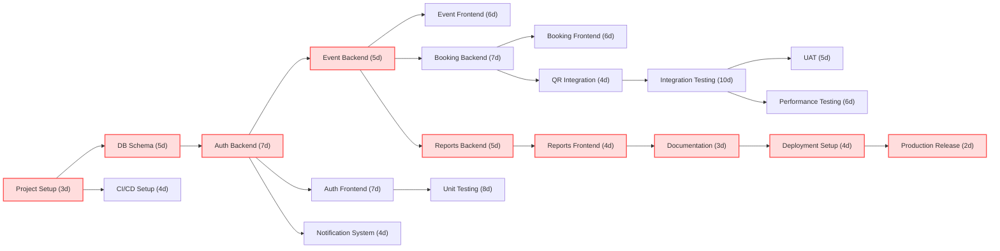

# Dependency Graph

```mermaid
graph LR
    A["Project Setup (3d)"] --> B["DB Schema (5d)"]
    A --> C["CI/CD Setup (4d)"]
    B --> D["Auth Backend (7d)"]
    D --> E["Auth Frontend (7d)"]
    D --> F["Event Backend (5d)"]
    F --> G["Event Frontend (6d)"]
    F --> H["Booking Backend (7d)"]
    H --> I["Booking Frontend (6d)"]
    H --> J["QR Integration (4d)"]
    D --> K["Notification System (4d)"]
    F --> L["Reports Backend (5d)"]
    L --> M["Reports Frontend (4d)"]
    E --> P["Unit Testing (8d)"]
    J --> Q["Integration Testing (10d)"]
    Q --> R["UAT (5d)"]
    Q --> S["Performance Testing (6d)"]
    M --> T["Documentation (3d)"]
    T --> U["Deployment Setup (4d)"]
    U --> V["Production Release (2d)"]

    %% Highlight critical path
    classDef crit fill:#ffdddd,stroke:#ff4d4d,stroke-width:2px;
    class A,B,D,F,L,M,T,U,V crit;
```
