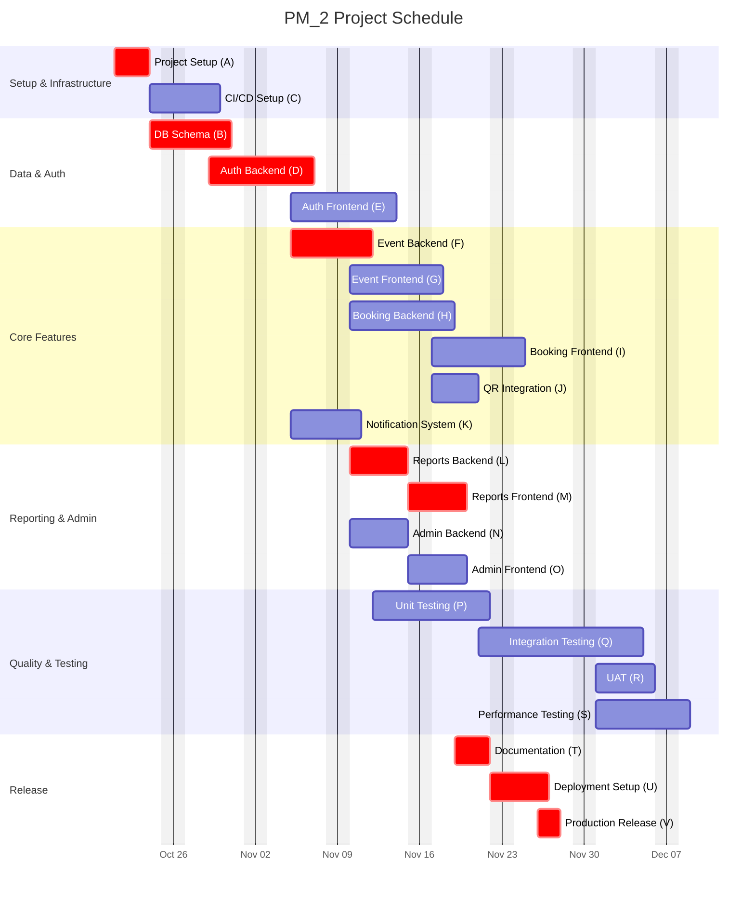

# PM_2 Gantt Chart

```mermaid
%%{init: {
  'theme': 'default',
  'themeVariables': { 'fontSize': '16px' },
  'gantt': {
    'axisFormat': '%b %d',
    'barHeight': 30,
    'barGap': 8,
    'topPadding': 50,
    'leftPadding': 120,
    'rightPadding': 60,
    'gridLineStartPadding': 50,
    'titleTopMargin': 25,
    'numberSectionStyles': 4
  }
}}%%
gantt
    title PM_2 Project Schedule
    dateFormat  YYYY-MM-DD
    axisFormat  %b %d
    excludes    weekends

    section Setup & Infrastructure
    Project Setup (A)        :crit, A, 2025-10-21, 3d
    CI/CD Setup (C)          : C, 2025-10-24, 4d

    section Data & Auth
    DB Schema (B)            :crit, B, 2025-10-24, 5d
    Auth Backend (D)         :crit, D, 2025-10-29, 7d
    Auth Frontend (E)        : E, 2025-11-05, 7d

    section Core Features
    Event Backend (F)        :crit, F, 2025-11-05, 5d
    Event Frontend (G)       : G, 2025-11-10, 6d
    Booking Backend (H)      : H, 2025-11-10, 7d
    Booking Frontend (I)     : I, 2025-11-17, 6d
    QR Integration (J)       : J, 2025-11-17, 4d
    Notification System (K)  : K, 2025-11-05, 4d

    section Reporting & Admin
    Reports Backend (L)      :crit, L, 2025-11-10, 5d
    Reports Frontend (M)     :crit, M, 2025-11-15, 4d
    Admin Backend (N)        : N, 2025-11-10, 5d
    Admin Frontend (O)       : O, 2025-11-15, 4d

    section Quality & Testing
    Unit Testing (P)         : P, 2025-11-12, 8d
    Integration Testing (Q)  : Q, 2025-11-21, 10d
    UAT (R)                  : R, 2025-12-01, 5d
    Performance Testing (S)  : S, 2025-12-01, 6d

    section Release
    Documentation (T)        :crit, T, 2025-11-19, 3d
    Deployment Setup (U)     :crit, U, 2025-11-22, 4d
    Production Release (V)   :crit, V, 2025-11-26, 2d
```
