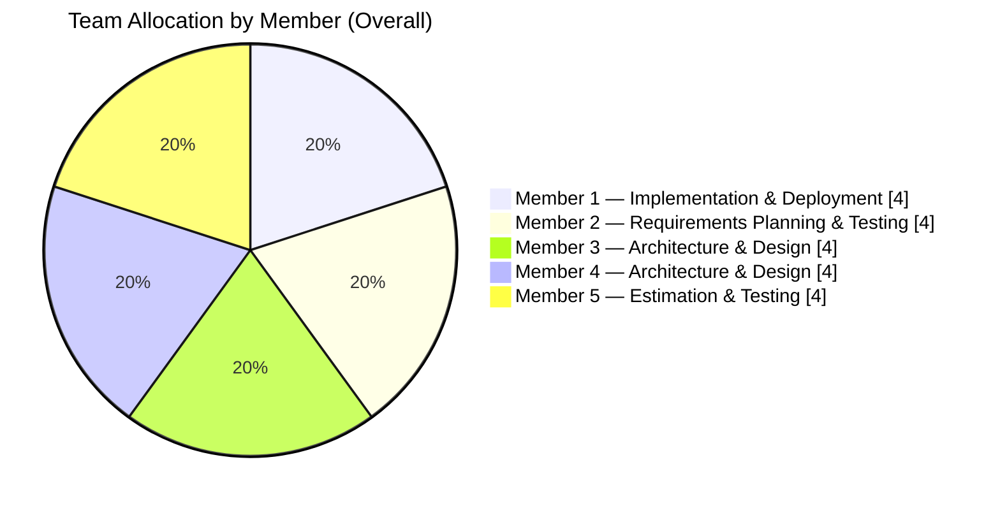

# Team Allocation — Overall Distribution

Based on `Docs/Pm_2/csv_data/team_allocation.csv` across 4 phases (Weeks 1–8). Each member is allocated work in every phase, resulting in an even distribution.

Notes:
- Each count reflects 1 phase assignment per member over 4 phases (Weeks 1–2, 3–4, 5–6, 7–8).
- If you prefer weighting by hours instead of occurrences, provide estimated hours per phase/member and I’ll update the chart.
