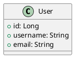

# AIU-Trips-And-Events

A university system that manages events and trips through a web app that manages the whole activities process.

## Features

- **Authentication & Profiles**: Login/Create Account with JWT authentication
- **Event/Trip Management**: Add/Edit/Delete events and trips
- **Booking & Ticketing**: Reservation system with QR Code generation for entry
- **Ticket Validation**: Validate tickets at event entry using QR codes
- **Payment Tracking**: Track cash-only payments for bookings
- **Notifications**: Real-time messages to students upon any update
- **Feedback System**: Students can provide ratings and comments after attending events
- **Reports & Analytics**: Participants count, income tracking, and feedback analysis

## Tech Stack

### Backend (Java)
- Spring Boot 3.2.0
- Spring Security with JWT
- Spring Data JPA
- H2 Database (in-memory)
- QR Code Generation (ZXing)
- Maven

### Frontend (Next.js)
- Next.js 15 with TypeScript
- Tailwind CSS
- Axios for API calls
- React Context for state management
- QR Code display

## Getting Started

### Prerequisites
- Java 17 or higher
- Node.js 18 or higher
- Maven
- Docker and Docker Compose (optional, for containerized deployment)

### Backend Setup

1. Navigate to the backend directory:
```bash
cd Project/backend
```

2. Build and run the Spring Boot application:
```bash
mvn spring-boot:run
```

The backend will start on `http://localhost:8080`

**Default Admin Credentials:**
- Email: `admin@aiu.edu`
- Password: `admin123`

### Frontend Setup

1. Navigate to the frontend directory:
```bash
cd frontend
```

2. Install dependencies:
```bash
npm install
```

3. Run the development server:
```bash
npm run dev
```

The frontend will start on `http://localhost:3000`

## API Endpoints

### Authentication
- `POST /api/auth/register` - Register new user
- `POST /api/auth/login` - Login user

### Events
- `GET /api/events` - Get all events
- `GET /api/events/{id}` - Get event by ID
- `GET /api/events/type/{type}` - Get events by type (EVENT/TRIP)
- `GET /api/events/upcoming` - Get upcoming events
- `POST /api/events` - Create new event (Admin)
- `PUT /api/events/{id}` - Update event (Admin)
- `DELETE /api/events/{id}` - Delete event (Admin)

### Bookings
- `POST /api/bookings/event/{eventId}` - Create booking
- `GET /api/bookings/my-bookings` - Get user's bookings
- `PUT /api/bookings/{bookingId}/cancel` - Cancel booking
- `GET /api/bookings/code/{code}` - Get booking by code
- `POST /api/bookings/validate/{bookingCode}` - Validate ticket at event entry

### Feedbacks
- `POST /api/feedbacks/event/{eventId}` - Submit feedback (requires attendance)
- `GET /api/feedbacks/event/{eventId}` - Get event feedbacks
- `GET /api/feedbacks/my-feedbacks` - Get user's feedbacks
- `GET /api/feedbacks/event/{eventId}/average-rating` - Get event average rating

### Notifications
- `GET /api/notifications` - Get all notifications
- `GET /api/notifications/unread` - Get unread notifications
- `PUT /api/notifications/{id}/read` - Mark as read

### Reports (Admin)
- `GET /api/admin/reports/overall` - Get overall statistics
- `GET /api/admin/reports/event/{eventId}` - Get event-specific report

## Default Users

An admin user is automatically created on application startup:
- **Email**: `admin@aiu.edu`
- **Password**: `admin123`

Students can register via the registration page and will automatically get the STUDENT role.

Access H2 Console at: `http://localhost:8080/h2-console`
- JDBC URL: `jdbc:h2:mem:tripsdb`
- Username: `sa`
- Password: (leave empty)

## Recent Improvements (Code Structure Enhancement)

The codebase has been significantly improved with the following structural enhancements:

### Type Safety
- ✅ **Enums instead of strings**: BookingStatus, EventStatus, EventType, UserRole, PaymentMethod
- ✅ Compile-time type checking
- ✅ Better IDE support and autocomplete

### Error Handling
- ✅ **Custom exceptions**: ResourceNotFoundException, BookingException, ValidationException
- ✅ **GlobalExceptionHandler**: Centralized error handling with proper HTTP status codes
- ✅ Consistent error response format across all endpoints

### Validation
- ✅ **Jakarta Bean Validation**: All input DTOs validated
- ✅ Automatic validation before business logic
- ✅ Detailed error messages for invalid input

### Code Quality
- ✅ **Constants class**: Eliminates magic strings
- ✅ **Clean DTOs**: Separation between entities and API responses
- ✅ **Better maintainability**: Easier to understand and modify

See [CODE_STRUCTURE_IMPROVEMENTS.md](./Docs/CODE_STRUCTURE_IMPROVEMENTS.md) for detailed documentation.

## Architecture

### Backend (SOLID Principles)
- **Single Responsibility**: Each service handles one concern
- **Open/Closed**: Easily extensible without modifying existing code
- **Liskov Substitution**: Interface-based design
- **Interface Segregation**: Focused repository interfaces
- **Dependency Inversion**: Dependencies injected via Spring

### DRY Principle
- Reusable components and services
- No code duplication
- Shared utilities and DTOs

## Project Structure

```
AIU-Trips-And-Events/
├── Project/
│   ├── backend/
│   │   ├── src/main/java/com/aiu/trips/
│   │   │   ├── config/           # Configuration classes
│   │   │   ├── constants/        # Application constants
│   │   │   ├── controller/       # REST Controllers
│   │   │   ├── dto/              # Data Transfer Objects
│   │   │   ├── enums/            # Type-safe enumerations
│   │   │   ├── exception/        # Custom exceptions & handlers
│   │   │   ├── model/            # JPA Entity Models
│   │   │   ├── repository/       # Data Access Layer
│   │   │   ├── security/         # Security & JWT Config
│   │   │   ├── service/          # Business Logic
│   │   │   └── util/             # Utilities (QR Code)
│   │   └── pom.xml
│   ├── frontend/
│   │   ├── app/                  # Next.js Pages
│   │   ├── components/           # React Components
│   │   ├── contexts/             # Context Providers
│   │   ├── lib/                  # API Client
│   │   └── package.json
├── Docs/                         # Documentation
│   ├── pm/                       # Project Management docs
│   └── CODE_STRUCTURE_IMPROVEMENTS.md
└── README.md
```

## CI/CD and Automation

### Continuous Integration

The project includes automated CI workflows that run on every push and pull request:

- **CI Workflow** (`.github/workflows/ci.yml`):
  - Runs tests for both backend (Maven) and frontend (npm)
  - Uses Node.js 18 and Java 17
  - Caches dependencies for faster builds
  - Automatically triggered on pushes to `main` and `develop` branches

### Deployment

The project supports automated deployment to a VM using Docker:

- **Deploy to VM Workflow** (`.github/workflows/deploy-to-vm.yml`):
  - Builds multi-arch Docker images for backend and frontend
  - Pushes images to GitHub Container Registry (GHCR)
  - Deploys to a remote VM via SSH using docker-compose
  - Triggers on pushes to `main` branch or manual dispatch

#### Required Secrets for Deployment

Configure these secrets in your GitHub repository settings:

| Secret | Description | Example |
|--------|-------------|---------|
| `SSH_HOST` | VM hostname or IP address | `your-server.com` or `192.168.1.100` |
| `SSH_USER` | SSH username | `deploy` |
| `SSH_PRIVATE_KEY` | SSH private key for authentication | Contents of your private key file |
| `SSH_PORT` | SSH port (optional, defaults to 22) | `22` |

#### VM Setup for Deployment

1. Install Docker and Docker Compose on your VM
2. Create deployment directory:
   ```bash
   sudo mkdir -p /opt/aiu-trips-events
   sudo chown $USER:$USER /opt/aiu-trips-events
   ```
3. Copy `docker-compose.yml` to the VM deployment directory
4. Ensure the deploy user has Docker permissions:
   ```bash
   sudo usermod -aG docker $USER
   ```

### Docker Deployment

#### Local Development with Docker

```bash
# Start all services in development mode
docker-compose -f docker-compose.dev.yml up

# Stop all services
docker-compose -f docker-compose.dev.yml down
```

#### Production Deployment with Docker

```bash
# Pull and start services with the latest images
docker-compose up -d

# View logs
docker-compose logs -f

# Stop all services
docker-compose down
```

### PlantUML Code Generator ("vibecoder")

The project includes an automated code generator that converts PlantUML class diagrams into TypeScript interfaces and Java DTOs:

- **Diagram Codegen Workflow** (`.github/workflows/diagram-codegen.yml`):
  - Triggers on changes to `diagrams/*.puml` files
  - Generates TypeScript interfaces in `generated/ts/`
  - Generates Java DTOs in `generated/java/`
  - Automatically creates a pull request with generated code

#### Using the Code Generator

1. Create or modify PlantUML diagrams in the `diagrams/` directory
2. Push changes to the `main` branch
3. The workflow automatically generates code and creates a PR
4. Review and merge the generated code

#### Manual Code Generation

```bash
# Run the generator locally
node tools/plantuml-to-code/index.js
```

#### Example PlantUML Diagram

See `diagrams/event-management.puml` for an example:



This generates:
- `generated/ts/User.ts` - TypeScript interface
- `generated/java/User.java` - Java DTO with getters/setters

### Docker Images

The project provides Dockerfiles for both backend and frontend:

- **Backend**: Multi-stage Maven build with Java 17 runtime
- **Frontend**: Multi-stage Node.js build with Next.js

Images are automatically built and pushed to GHCR during deployment.

## License

This project is for educational purposes.
