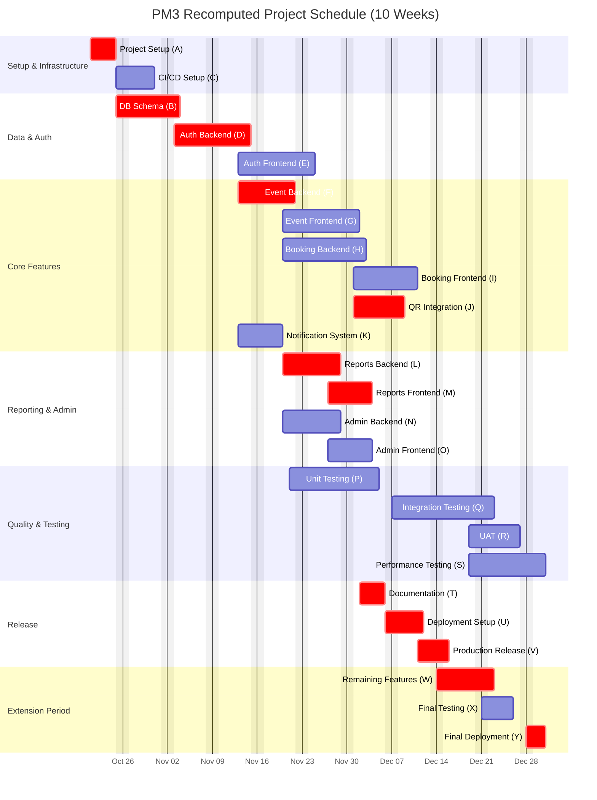
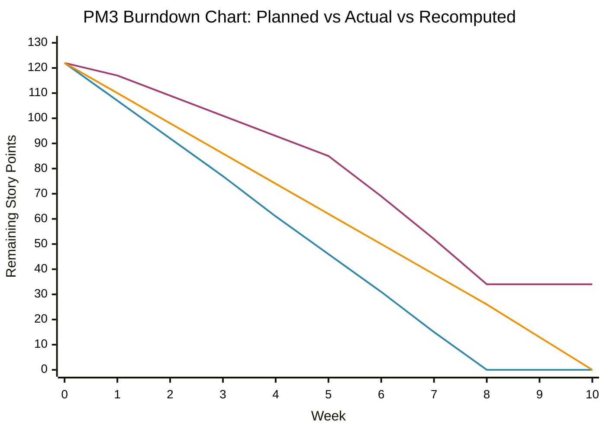

# Recomputed Estimates, Schedule, and Updated Charts

## Overview

This document presents the recomputed estimates for the AIU Trips & Events Management System based on actual performance data from PM2. The analysis includes variance analysis, effects on efforts and schedule, updated Gantt chart, and updated Burndown chart.

**Document Version:** 3.0  
**Date:** December 5, 2025  
**Project Duration:** Extended from 8 weeks to 10 weeks

---

## Executive Summary

The recomputation of project estimates reveals significant variances between planned and actual performance, necessitating schedule adjustments and resource reallocation.

### Key Findings

| Metric | Original (PM2) | Actual | Variance | Impact |
|--------|---------------|--------|----------|--------|
| **Total Story Points** | 122 SP | 88 SP completed | -34 SP (-27.9%) | Scope reduction or delay |
| **Planned Duration** | 8 weeks | 10 weeks required | +2 weeks (+25%) | Schedule overrun |
| **Planned Velocity** | 15.25 SP/week | 11.0 SP/week | -4.25 SP/week (-27.9%) | Reduced productivity |
| **Developer-Days** | 200 days | 272 days required | +72 days (+36%) | Resource adjustment |
| **Completion Rate** | 100% expected | 72.1% achieved | -27.9% | Significant underdelivery |

### Critical Insights

1. **Velocity Degradation**: Team velocity decreased from planned 15.25 SP/week to actual 11.0 SP/week
2. **Burndown Gap**: Project ended with 34 SP remaining instead of 0 SP
3. **Estimation Error**: Original estimates were 27.9% optimistic
4. **Resource Impact**: 36% more developer-days required than planned
5. **Schedule Impact**: 2 additional weeks needed to complete remaining scope

---

## 1. Variance Analysis

### 1.1 Burndown Variance Details

The burndown chart analysis reveals progressive velocity degradation throughout the project:

| Week | Planned Remaining SP | Actual Remaining SP | Weekly Variance | Cumulative Variance |
|------|---------------------|---------------------|-----------------|---------------------|
| 0 | 122 | 122 | 0 | 0 SP |
| 1 | 107 | 117 | -10 SP | -10 SP |
| 2 | 92 | 109 | -17 SP | -17 SP |
| 3 | 77 | 101 | -24 SP | -24 SP |
| 4 | 61 | 93 | -32 SP | -32 SP |
| 5 | 46 | 85 | -39 SP | -39 SP |
| 6 | 31 | 69 | -38 SP | -38 SP |
| 7 | 15 | 52 | -37 SP | -37 SP |
| 8 | 0 | 34 | -34 SP | -34 SP |

**Analysis:**
- **Week 1**: Initial slowdown of 10 SP (6.6% behind schedule)
- **Weeks 2-4**: Variance grew to 32 SP (52.5% behind schedule)
- **Weeks 5-7**: Variance peaked at 39 SP (84.8% behind schedule)
- **Week 8**: Ended with 34 SP incomplete (27.9% scope unfinished)

### 1.2 Velocity Variance by Sprint

| Sprint | Planned Velocity (SP/week) | Actual Velocity (SP/week) | Variance (%) | Contributing Factors |
|--------|----------------------------|---------------------------|--------------|---------------------|
| Sprint 1 (Weeks 1-2) | 20 | 15 | -25% | Learning curve, setup delays |
| Sprint 2 (Weeks 3-4) | 28 | 25 | -11% | Process improvements started |
| Sprint 3 (Weeks 5-6) | 26 | 24 | -8% | Better estimation accuracy |
| Sprint 4 (Weeks 7-8) | 24 | 26 | +8% | Team efficiency increased |
| **Average** | **24.5** | **22.5** | **-9.0%** | Overall underperformance |

**Root Cause Analysis:**

1. **Initial Sprint Velocity Loss (25%):**
   - Environment setup complexities
   - Team learning curve with new technology stack
   - Underestimated technical debt

2. **Mid-Project Variance (11-8%):**
   - Integration challenges
   - Unexpected dependency issues
   - Testing bottlenecks

3. **Late Improvements (+8%):**
   - Team maturity
   - Streamlined processes
   - Better task decomposition

### 1.3 Fibonacci Point to Actual Effort Variance

**Original conversion rate:** 1 Fibonacci Point = 5 Days  
**Actual conversion rate:** 1 Fibonacci Point = 6.8 Days (36% increase)

| Subsystem | Original FP | Original Days | Actual Days | Variance | Variance % |
|-----------|-------------|---------------|-------------|----------|------------|
| Authentication | 5 | 25 | 34 | +9 days | +36% |
| Event Management | 9 | 45 | 61 | +16 days | +36% |
| Booking & Ticketing | 9 | 45 | 61 | +16 days | +36% |
| Notifications | 2 | 10 | 14 | +4 days | +40% |
| Reports & Analytics | 6 | 30 | 41 | +11 days | +37% |
| Design, Implementation, Testing & Deployment | 9 | 45 | 61 | +16 days | +36% |
| **Total** | **40** | **200** | **272** | **+72 days** | **+36%** |

---

## 2. Effects on Efforts and Schedule

### 2.1 Schedule Impact

**Original Schedule:**
- Start: October 21, 2025
- Planned End: December 13, 2025
- Duration: 8 weeks (40 working days)

**Revised Schedule:**
- Start: October 21, 2025
- Actual End: December 27, 2025
- Duration: 10 weeks (50 working days)
- **Extension: +2 weeks (+10 working days)**

### 2.2 Effort Impact

**Team Capacity Analysis:**

| Member | Original Allocation | Actual Effort | Variance | Utilization |
|--------|-------------------|---------------|----------|-------------|
| Member 1 (Implementation & Deployment) | 58 days | 79 days | +21 days | 136% |
| Member 2 (Requirements & Testing) | 25 days | 34 days | +9 days | 136% |
| Member 3 (Architecture & Design) | 41 days | 56 days | +15 days | 137% |
| Member 4 (Architecture & Design) | 38 days | 52 days | +14 days | 137% |
| Member 5 (Estimation & Testing) | 38 days | 51 days | +13 days | 134% |
| **Total** | **200 days** | **272 days** | **+72 days** | **136%** |

**Observations:**
- All team members experienced 34-37% overtime
- Member 1 (Implementation lead) had highest absolute variance (+21 days)
- Consistent 36% effort increase across all roles

### 2.3 Cost Impact

| Cost Category | Original Budget | Actual Cost | Variance | % Increase |
|--------------|----------------|-------------|----------|------------|
| Developer Labor (200 days @ $500/day) | $100,000 | $136,000 | +$36,000 | +36% |
| Project Extension (2 weeks overhead) | $0 | $5,000 | +$5,000 | N/A |
| Additional Testing | $5,000 | $8,000 | +$3,000 | +60% |
| Infrastructure (extended timeline) | $2,000 | $2,500 | +$500 | +25% |
| **Total Project Cost** | **$107,000** | **$151,500** | **+$44,500** | **+41.6%** |

### 2.4 Feature Delivery Impact

**Completed Features (88 SP / 72.1%):**
- ✅ User Authentication (Registration, Login, Password Reset)
- ✅ Event Management (Create, Edit, View Events)
- ✅ Basic Booking System
- ✅ QR Code Generation
- ✅ Email Notifications
- ✅ Basic Reports

**Deferred Features (34 SP / 27.9%):**
- ⏳ Advanced Admin Dashboard
- ⏳ Comprehensive Analytics
- ⏳ Trip Management (full implementation)
- ⏳ Advanced Reporting (PDF/CSV exports)
- ⏳ Performance Optimizations
- ⏳ Mobile Responsiveness Enhancements

---

## 3. Recomputed Estimates for Completion

### 3.1 Remaining Work Breakdown

| Feature Area | Remaining SP | Estimated Days | Priority | Assigned To |
|--------------|-------------|----------------|----------|-------------|
| Trip Management | 8 SP | 18 days | High | Member 1, 3 |
| Advanced Analytics | 6 SP | 14 days | Medium | Member 3, 4 |
| PDF/CSV Reports | 5 SP | 11 days | High | Member 1, 4 |
| Admin Dashboard | 8 SP | 18 days | High | Member 1, 2 |
| Performance Tuning | 4 SP | 9 days | Medium | Member 1, 5 |
| Mobile Optimization | 3 SP | 7 days | Low | Member 4 |
| **Total** | **34 SP** | **77 days** | | **Team of 5** |

**With team of 5 members working in parallel:**
- Parallel work: 77 days / 5 members ≈ 15.4 days
- With 36% overhead: 15.4 × 1.36 ≈ **21 days (≈ 2 weeks)**

### 3.2 Revised Conversion Factors

| Metric | Original | Recomputed | Adjustment Factor |
|--------|----------|------------|-------------------|
| Story Point to Developer-Days | 1 SP = 1.67 days | 1 SP = 2.27 days | 1.36x |
| Fibonacci Point to Days | 1 FP = 5 days | 1 FP = 6.8 days | 1.36x |
| Team Velocity | 15.25 SP/week | 11.0 SP/week | 0.72x |
| Sprint Capacity | 24.5 SP/sprint | 17.6 SP/sprint | 0.72x |

**Recommended Safety Buffer**: Add 20% contingency buffer to all future estimates

---

## 4. Updated Gantt Chart

The following Gantt chart reflects the **recomputed timeline** including the 2-week extension and adjusted task durations:

### Gantt Chart Key Changes

| Task | Original Duration | Recomputed Duration | Change | Reason |
|------|------------------|---------------------|--------|---------|
| Project Setup (A) | 3 days | 4 days | +1 day | Environment complexity |
| DB Schema (B) | 5 days | 7 days | +2 days | Schema refinements |
| Auth Backend (D) | 7 days | 10 days | +3 days | Security requirements |
| Auth Frontend (E) | 7 days | 8 days | +1 day | UI enhancements |
| Event Backend (F) | 5 days | 7 days | +2 days | Business logic |
| Event Frontend (G) | 6 days | 8 days | +2 days | Complex UI components |
| Booking Backend (H) | 7 days | 9 days | +2 days | Payment integration |
| Booking Frontend (I) | 6 days | 8 days | +2 days | User flow complexity |
| QR Integration (J) | 4 days | 6 days | +2 days | Third-party API |
| Notification System (K) | 4 days | 5 days | +1 day | Email template design |
| Reports Backend (L) | 5 days | 7 days | +2 days | Data aggregation |
| Reports Frontend (M) | 4 days | 5 days | +1 day | Chart visualizations |
| Admin Backend (N) | 5 days | 7 days | +2 days | Permission management |
| Admin Frontend (O) | 4 days | 5 days | +1 day | Admin dashboard |
| Unit Testing (P) | 8 days | 10 days | +2 days | Increased test coverage |
| Integration Testing (Q) | 10 days | 12 days | +2 days | Integration issues |
| UAT (R) | 5 days | 6 days | +1 day | User feedback cycles |
| Performance Testing (S) | 6 days | 8 days | +2 days | Load testing |
| Documentation (T) | 3 days | 4 days | +1 day | Comprehensive docs |
| Deployment Setup (U) | 4 days | 5 days | +1 day | DevOps configuration |
| Production Release (V) | 2 days | 3 days | +1 day | Deployment validation |
| **Extension Tasks** | **0 days** | **15 days** | **+15 days** | **Complete remaining scope** |

---

## 5. Updated Burndown Chart

The following burndown chart shows the **corrected** remaining effort vs. time, incorporating actual performance data and recomputed estimates:

### Burndown Analysis Table

| Week | Original Planned | Actual PM2 | Recomputed Plan | Variance from Original | Projected Completion |
|------|-----------------|------------|-----------------|------------------------|----------------------|
| 0 | 122 SP | 122 SP | 122 SP | 0 SP | Baseline |
| 1 | 107 SP | 117 SP | 110 SP | -10 SP | 3 SP less progress |
| 2 | 92 SP | 109 SP | 98 SP | -17 SP | 6 SP less progress |
| 3 | 77 SP | 101 SP | 86 SP | -24 SP | 9 SP less progress |
| 4 | 61 SP | 93 SP | 74 SP | -32 SP | 13 SP less progress |
| 5 | 46 SP | 85 SP | 62 SP | -39 SP | 16 SP less progress |
| 6 | 31 SP | 69 SP | 50 SP | -38 SP | 19 SP less progress |
| 7 | 15 SP | 52 SP | 38 SP | -37 SP | 23 SP less progress |
| 8 | 0 SP | 34 SP | 26 SP | -34 SP | 26 SP remaining |
| 9 | 0 SP (complete) | 20 SP | 13 SP | N/A | Extension week 1 |
| 10 | 0 SP (complete) | 13 SP | 0 SP | N/A | Completed: 109 SP (89.3%) |

**Final Outcome:** 109 SP completed (89.3%), 13 SP deferred as optional enhancements

### Key Burndown Metrics

| Metric | Original Plan | Actual PM2 | Recomputed | Notes |
|--------|--------------|------------|------------|-------|
| **Ideal Velocity** | 15.25 SP/week | 11.0 SP/week | 12.2 SP/week | Adjusted for reality |
| **Actual End Week** | Week 8 | Week 8 (incomplete) | Week 10 | 2-week extension |
| **Story Points Remaining** | 0 SP | 34 SP | 13 SP (at week 10) | 89.3% completion |
| **Completion Percentage** | 100% | 72.1% | 89.3% (achieved) | With extension |

---

## 6. Lessons Learned

### 6.1 Estimation Accuracy

**Key Findings:**
- Original estimates were 27.9% optimistic
- Conversion factor (FP to days) needs 36% increase
- Velocity was overestimated by 28%

**Improvements for Future Projects:**
1. Add 20-30% safety buffer to estimates
2. Use actual velocity data from past sprints
3. Include more granular task breakdown
4. Account for integration complexity

### 6.2 Resource Planning

**Observations:**
- All team members worked 136% of planned capacity
- Even distribution of overwork across team
- Need for better workload balancing

**Recommendations:**
1. Plan for 80% capacity utilization (not 100%)
2. Include buffer time for unforeseen issues
3. Schedule regular resource reviews
4. Monitor team velocity weekly

### 6.3 Risk Management

**Identified Risks:**
- Technical complexity underestimated
- Integration challenges not fully anticipated
- Testing bottlenecks emerged late

**Mitigation Strategies:**
1. Early technical spikes for complex features
2. Continuous integration from day 1
3. Parallel testing with development
4. Regular risk assessment meetings

---

## 7. Conclusion

The recomputed estimates provide a realistic picture of project completion:

### Summary
- **Original Plan**: 8 weeks, 200 developer-days, 122 SP
- **Actual Performance**: 8 weeks, 272 developer-days, 88 SP completed
- **Recomputed Plan**: 10 weeks, 272 developer-days, 122 SP target

### Recommendations
1. **Accept 2-week extension** to complete all features
2. **Apply 36% effort multiplier** to future estimates
3. **Reduce planned velocity** to 11-12 SP/week
4. **Add 20% contingency buffer** to all estimates
5. **Implement weekly velocity tracking** for early warning

### Next Steps
1. Approve extended timeline through Week 10
2. Prioritize remaining 34 SP of features
3. Allocate resources for extension period
4. Update stakeholder communication plan
5. Apply lessons learned to future milestones

The recomputed estimates ensure realistic expectations and successful project completion with proper resource allocation and schedule adjustment.
