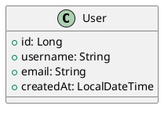
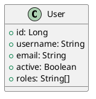

# PlantUML to Code Generator (vibecoder)

A lightweight code generator that converts PlantUML class diagrams into TypeScript interfaces and Java DTOs.

## Features

- 📊 Parses PlantUML class diagrams (`.puml` files)
- 🔄 Generates TypeScript interfaces
- ☕ Generates Java DTOs with getters/setters
- 🚀 Zero external dependencies (uses only Node.js built-ins)
- 🎯 Simple and maintainable

## Usage

### Automatic Generation (via GitHub Actions)

When you push changes to `diagrams/*.puml` files, the code generator automatically:
1. Parses the modified diagrams
2. Generates TypeScript and Java code
3. Creates a pull request with the generated code

### Manual Generation

```bash
# Run from repository root
node tools/plantuml-to-code/index.js
```

This will:
- Read all `.puml` files from `diagrams/`
- Generate TypeScript interfaces in `generated/ts/`
- Generate Java DTOs in `generated/java/`

## Supported PlantUML Syntax

### Class Definition



### Property Visibility

- `+` Public (default, included in output)
- `-` Private (included in output)
- `#` Protected (included in output)
- `~` Package (included in output)

### Supported Types

#### PlantUML Type → TypeScript Type

- `String` → `string`
- `Integer`, `int`, `Long`, `long` → `number`
- `Double`, `double`, `Float`, `float` → `number`
- `Boolean`, `boolean` → `boolean`
- `Date`, `LocalDate`, `LocalDateTime`, `Instant` → `string` or `Date`
- Arrays: `Type[]` → `Type[]`

#### PlantUML Type → Java Type

- `String` → `String`
- `Integer`, `int` → `Integer`, `int`
- `Long`, `long` → `Long`, `long`
- `Double`, `double` → `Double`, `double`
- `Float`, `float` → `Float`, `float`
- `Boolean`, `boolean` → `Boolean`, `boolean`
- `Date` → `java.util.Date`
- `LocalDate` → `java.time.LocalDate`
- `LocalDateTime` → `java.time.LocalDateTime`
- `Instant` → `java.time.Instant`
- Arrays: `Type[]` → `java.util.List<Type>`

## Example

### Input (diagrams/user.puml)



### Output TypeScript (generated/ts/User.ts)

```typescript
/**
 * Generated from PlantUML diagram
 * @generated
 */
export interface User {
  id: number;
  username: string;
  email: string;
  active: boolean;
  roles: string[];
}
```

### Output Java (generated/java/User.java)

```java
package com.aiu.trips.dto.generated;

import java.util.List;

/**
 * Generated from PlantUML diagram
 * @generated
 */
public class User {

    private Long id;
    private String username;
    private String email;
    private Boolean active;
    private List<String> roles;

    public Long getId() {
        return id;
    }

    public void setId(Long id) {
        this.id = id;
    }

    // ... other getters and setters
}
```

## Limitations

- Only parses class definitions (not interfaces, enums, or abstract classes)
- Does not parse methods or constructors
- Does not parse relationships between classes
- Simple type mapping (no generic type parameters except for arrays/lists)
- No validation of PlantUML syntax beyond basic class parsing

## Future Enhancements

Potential improvements for the future:
- Support for enum parsing
- Support for interface parsing
- Support for class relationships (associations, inheritance)
- Support for method signatures
- Validation annotations (Java Bean Validation, TypeScript decorators)
- Custom type mappings via configuration file
