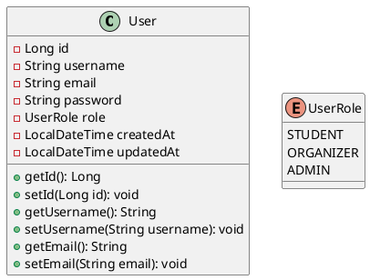
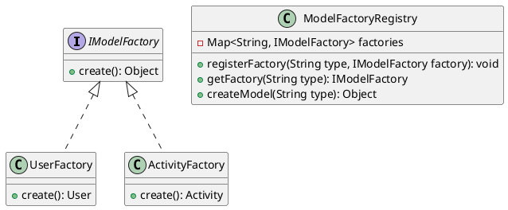
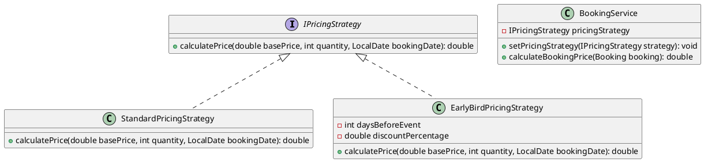
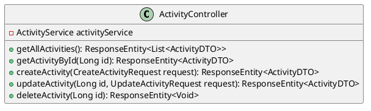

# Few-Shot Prompt: Learning from Examples

## 🎯 Output Directory

**Generate all code in:** `/home/runner/work/AIU-Trips-And-Events/AIU-Trips-And-Events/vibe_tests/04_few_shot/`

This directory will contain your complete generated project using the Few-Shot Learning framework.

## Repository Context
**Location:** `/home/runner/work/AIU-Trips-And-Events/AIU-Trips-And-Events/`
**Source Data:** `vibe_tests/data/*.pu` (PlantUML diagrams)
**Target:** `vibe_tests/04_few_shot/backend/` and `vibe_tests/04_few_shot/frontend/`

---

## Task: Generate Complete AIU Trips & Events System

You need to implement a complete university event and trip management system based on PlantUML diagrams located in `vibe_tests/data/`. These diagrams show the architecture **after design patterns** have been applied.

Let me show you examples of how to translate PlantUML diagrams into working code:

---

## Example 1: Translating an Entity from PlantUML to Java

### Input PlantUML (from diagram):


### Output Java Code:

**UserRole.java:**
```java
package com.aiu.trips.enums;

public enum UserRole {
    STUDENT,
    ORGANIZER,
    ADMIN
}
```

**User.java:**
```java
package com.aiu.trips.model;

import com.aiu.trips.enums.UserRole;
import jakarta.persistence.*;
import lombok.AllArgsConstructor;
import lombok.Data;
import lombok.NoArgsConstructor;
import java.time.LocalDateTime;

@Entity
@Table(name = "users")
@Data
@NoArgsConstructor
@AllArgsConstructor
public class User {
    
    @Id
    @GeneratedValue(strategy = GenerationType.IDENTITY)
    private Long id;
    
    @Column(unique = true, nullable = false)
    private String username;
    
    @Column(unique = true, nullable = false)
    private String email;
    
    @Column(nullable = false)
    private String password;
    
    @Enumerated(EnumType.STRING)
    @Column(nullable = false)
    private UserRole role;
    
    @Column(name = "created_at", nullable = false, updatable = false)
    private LocalDateTime createdAt;
    
    @Column(name = "updated_at")
    private LocalDateTime updatedAt;
    
    @PrePersist
    protected void onCreate() {
        createdAt = LocalDateTime.now();
        updatedAt = LocalDateTime.now();
    }
    
    @PreUpdate
    protected void onUpdate() {
        updatedAt = LocalDateTime.now();
    }
}
```

**Lesson:** Transform PlantUML classes into JPA entities with proper annotations, use Lombok for boilerplate, add lifecycle callbacks.

---

## Example 2: Implementing a Design Pattern (Factory Pattern)

### Input PlantUML (from Model_Factory.pu):


### Output Java Code:

**IModelFactory.java:**
```java
package com.aiu.trips.factory;

public interface IModelFactory<T> {
    T create();
}
```

**UserFactory.java:**
```java
package com.aiu.trips.factory;

import com.aiu.trips.model.User;
import com.aiu.trips.enums.UserRole;

public class UserFactory implements IModelFactory<User> {
    
    @Override
    public User create() {
        User user = new User();
        user.setRole(UserRole.STUDENT); // default role
        return user;
    }
    
    public User createWithRole(UserRole role) {
        User user = create();
        user.setRole(role);
        return user;
    }
}
```

**ModelFactoryRegistry.java:**
```java
package com.aiu.trips.factory;

import org.springframework.stereotype.Component;
import java.util.HashMap;
import java.util.Map;

@Component
public class ModelFactoryRegistry {
    
    private final Map<String, IModelFactory<?>> factories = new HashMap<>();
    
    public void registerFactory(String type, IModelFactory<?> factory) {
        factories.put(type, factory);
    }
    
    public IModelFactory<?> getFactory(String type) {
        IModelFactory<?> factory = factories.get(type);
        if (factory == null) {
            throw new IllegalArgumentException("No factory registered for type: " + type);
        }
        return factory;
    }
    
    public Object createModel(String type) {
        return getFactory(type).create();
    }
}
```

**Lesson:** Design patterns from diagrams translate to well-structured code with clear separation of concerns.

---

## Example 3: Implementing Strategy Pattern

### Input PlantUML (from Booking_Ticketing.pu):


### Output Java Code:

**IPricingStrategy.java:**
```java
package com.aiu.trips.strategy;

import java.time.LocalDate;

public interface IPricingStrategy {
    double calculatePrice(double basePrice, int quantity, LocalDate bookingDate, LocalDate eventDate);
}
```

**StandardPricingStrategy.java:**
```java
package com.aiu.trips.strategy;

import org.springframework.stereotype.Component;
import java.time.LocalDate;

@Component
public class StandardPricingStrategy implements IPricingStrategy {
    
    @Override
    public double calculatePrice(double basePrice, int quantity, LocalDate bookingDate, LocalDate eventDate) {
        return basePrice * quantity;
    }
}
```

**EarlyBirdPricingStrategy.java:**
```java
package com.aiu.trips.strategy;

import org.springframework.stereotype.Component;
import java.time.LocalDate;
import java.time.temporal.ChronoUnit;

@Component
public class EarlyBirdPricingStrategy implements IPricingStrategy {
    
    private static final int EARLY_BIRD_DAYS = 30;
    private static final double DISCOUNT_PERCENTAGE = 0.15; // 15% discount
    
    @Override
    public double calculatePrice(double basePrice, int quantity, LocalDate bookingDate, LocalDate eventDate) {
        long daysUntilEvent = ChronoUnit.DAYS.between(bookingDate, eventDate);
        
        if (daysUntilEvent >= EARLY_BIRD_DAYS) {
            double discountedPrice = basePrice * (1 - DISCOUNT_PERCENTAGE);
            return discountedPrice * quantity;
        }
        
        return basePrice * quantity;
    }
}
```

**BookingService.java (excerpt):**
```java
package com.aiu.trips.service;

import com.aiu.trips.strategy.IPricingStrategy;
import org.springframework.stereotype.Service;

@Service
public class BookingService {
    
    private IPricingStrategy pricingStrategy;
    
    public void setPricingStrategy(IPricingStrategy strategy) {
        this.pricingStrategy = strategy;
    }
    
    public double calculateBookingPrice(Booking booking, Activity activity) {
        if (pricingStrategy == null) {
            pricingStrategy = new StandardPricingStrategy();
        }
        
        return pricingStrategy.calculatePrice(
            activity.getPrice(),
            booking.getQuantity(),
            booking.getBookingDate(),
            activity.getStartDate()
        );
    }
}
```

**Lesson:** Strategy pattern allows flexible runtime algorithm selection, perfect for pricing logic.

---

## Example 4: REST Controller Implementation

### Input PlantUML (from Controller.pu):


### Output Java Code:

**ActivityController.java:**
```java
package com.aiu.trips.controller;

import com.aiu.trips.dto.ActivityDTO;
import com.aiu.trips.dto.CreateActivityRequest;
import com.aiu.trips.dto.UpdateActivityRequest;
import com.aiu.trips.service.ActivityService;
import lombok.RequiredArgsConstructor;
import org.springframework.http.HttpStatus;
import org.springframework.http.ResponseEntity;
import org.springframework.security.access.prepost.PreAuthorize;
import org.springframework.web.bind.annotation.*;

import jakarta.validation.Valid;
import java.util.List;

@RestController
@RequestMapping("/api/activities")
@RequiredArgsConstructor
@CrossOrigin(origins = "*")
public class ActivityController {
    
    private final ActivityService activityService;
    
    @GetMapping
    public ResponseEntity<List<ActivityDTO>> getAllActivities(
            @RequestParam(required = false) String status,
            @RequestParam(required = false) String category
    ) {
        List<ActivityDTO> activities = activityService.getAllActivities(status, category);
        return ResponseEntity.ok(activities);
    }
    
    @GetMapping("/{id}")
    public ResponseEntity<ActivityDTO> getActivityById(@PathVariable Long id) {
        ActivityDTO activity = activityService.getActivityById(id);
        return ResponseEntity.ok(activity);
    }
    
    @PostMapping
    @PreAuthorize("hasAnyRole('ORGANIZER', 'ADMIN')")
    public ResponseEntity<ActivityDTO> createActivity(@Valid @RequestBody CreateActivityRequest request) {
        ActivityDTO created = activityService.createActivity(request);
        return ResponseEntity.status(HttpStatus.CREATED).body(created);
    }
    
    @PutMapping("/{id}")
    @PreAuthorize("hasAnyRole('ORGANIZER', 'ADMIN')")
    public ResponseEntity<ActivityDTO> updateActivity(
            @PathVariable Long id,
            @Valid @RequestBody UpdateActivityRequest request
    ) {
        ActivityDTO updated = activityService.updateActivity(id, request);
        return ResponseEntity.ok(updated);
    }
    
    @DeleteMapping("/{id}")
    @PreAuthorize("hasRole('ADMIN')")
    public ResponseEntity<Void> deleteActivity(@PathVariable Long id) {
        activityService.deleteActivity(id);
        return ResponseEntity.noContent().build();
    }
}
```

**Lesson:** Controllers handle HTTP, delegate to services, use annotations for security and validation.

---

## Example 5: Frontend Component (React + TypeScript)

### Input: Need to display list of activities

### Output TypeScript/React Code:

**ActivityList.tsx:**
```typescript
'use client';

import React, { useEffect, useState } from 'react';
import { activityService } from '@/services/api/activityService';
import { Activity } from '@/types/Activity';
import ActivityCard from './ActivityCard';
import Loading from '@/components/common/Loading';
import ErrorMessage from '@/components/common/ErrorMessage';

export default function ActivityList() {
  const [activities, setActivities] = useState<Activity[]>([]);
  const [loading, setLoading] = useState<boolean>(true);
  const [error, setError] = useState<string | null>(null);

  useEffect(() => {
    fetchActivities();
  }, []);

  const fetchActivities = async () => {
    try {
      setLoading(true);
      const data = await activityService.getAll();
      setActivities(data);
      setError(null);
    } catch (err: any) {
      setError(err.response?.data?.message || 'Failed to load activities');
    } finally {
      setLoading(false);
    }
  };

  if (loading) return <Loading />;
  if (error) return <ErrorMessage message={error} />;

  return (
    <div className="container mx-auto px-4 py-8">
      <div className="flex justify-between items-center mb-6">
        <h1 className="text-3xl font-bold text-gray-800">Activities</h1>
        <button 
          onClick={() => window.location.href = '/activities/create'}
          className="bg-blue-600 text-white px-6 py-2 rounded-lg hover:bg-blue-700 transition"
        >
          Create Activity
        </button>
      </div>
      
      {activities.length === 0 ? (
        <p className="text-center text-gray-500 py-8">No activities found</p>
      ) : (
        <div className="grid grid-cols-1 md:grid-cols-2 lg:grid-cols-3 gap-6">
          {activities.map((activity) => (
            <ActivityCard key={activity.id} activity={activity} />
          ))}
        </div>
      )}
    </div>
  );
}
```

**activityService.ts:**
```typescript
import axiosInstance from './axiosConfig';
import { Activity, CreateActivityRequest, UpdateActivityRequest } from '@/types/Activity';

export const activityService = {
  async getAll(status?: string, category?: string): Promise<Activity[]> {
    const params = new URLSearchParams();
    if (status) params.append('status', status);
    if (category) params.append('category', category);
    
    const response = await axiosInstance.get(`/activities?${params.toString()}`);
    return response.data;
  },

  async getById(id: number): Promise<Activity> {
    const response = await axiosInstance.get(`/activities/${id}`);
    return response.data;
  },

  async create(data: CreateActivityRequest): Promise<Activity> {
    const response = await axiosInstance.post('/activities', data);
    return response.data;
  },

  async update(id: number, data: UpdateActivityRequest): Promise<Activity> {
    const response = await axiosInstance.put(`/activities/${id}`, data);
    return response.data;
  },

  async delete(id: number): Promise<void> {
    await axiosInstance.delete(`/activities/${id}`);
  }
};
```

**Lesson:** Frontend mirrors backend structure, uses TypeScript for type safety, handles loading/error states.

---

## Now It's Your Turn!

Using the examples above as a guide, implement the complete AIU Trips & Events Management System:

### Your Data Source
All PlantUML diagrams are in: `vibe_tests/data/`

Read these files:
1. University_Trips_Events_Management_System.pu
2. Model_Factory.pu
3. Data_Layer.pu
4. Event_Management.pu
5. User_Management_.pu
6. Booking_Ticketing.pu
7. Notification.pu
8. Reports_Analytics.pu
9. Repository_Layer.pu
10. Controller.pu

### Your Target

**⚠️ IMPORTANT - Output Location:**

Generate ALL code in: `/home/runner/work/AIU-Trips-And-Events/AIU-Trips-And-Events/vibe_tests/04_few_shot/`

Create this structure:
```
vibe_tests/04_few_shot/
├── backend/          # Spring Boot application
├── frontend/         # Next.js application
├── docker-compose.yml
└── README.md         # Example reference notes
```

### What to Generate

**Backend (Spring Boot):**
- All entity classes (like User example)
- All 11 design patterns (like Factory and Strategy examples)
- All repositories (Spring Data JPA)
- All services (business logic)
- All controllers (like ActivityController example)
- Security configuration (JWT)
- Exception handling
- pom.xml with dependencies

**Frontend (Next.js + TypeScript):**
- All type definitions
- All API services (like activityService example)
- All components (like ActivityList example)
- All pages using App Router
- Context providers
- Tailwind CSS styling
- package.json with dependencies

**DevOps:**
- Dockerfiles for backend and frontend
- docker-compose.yml
- Environment configuration

### Key Patterns to Follow

1. **Entity → JPA class with annotations** (Example 1)
2. **Design pattern from diagram → Java implementation** (Example 2)
3. **Behavioral pattern → Interface + implementations** (Example 3)
4. **Controller → REST endpoints with security** (Example 4)
5. **Frontend → React components + API services** (Example 5)

### Quality Checklist

- ✅ 100% of classes from diagrams implemented
- ✅ All 11 design patterns correctly applied
- ✅ Code compiles without errors
- ✅ Proper naming conventions
- ✅ Type safety (TypeScript in frontend)
- ✅ Error handling
- ✅ Security (JWT)
- ✅ Responsive UI

**Target Quality Score:** 8.7+/10

---

**Start by reading all diagram files, then generate the complete project following the examples shown above!**
